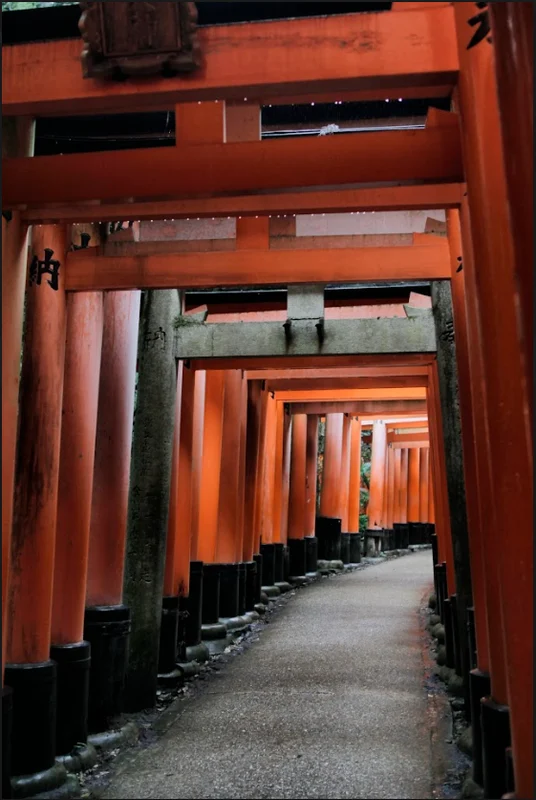

# 01 - Red Gate Mystery

**Category:** OSINT
**Points:** 100
**Platform:** cap26ctf.xyz

## Challenge Description

> A single photo was recovered from a burner phone left behind at a local safehouse.
> It shows an endless, tightly packed tunnel of vermilion wooden archways, with black
> Kanji inscriptions carved into the pillars.
>
> The target is hiding out here. Find the name of this cultural site to track them down.
>
> Flag format: `CAP26{Name1_Name2_Name3}`

The challenge provided a single downloadable file, `image.png`:

## Approach

- The image shows a long, tightly packed tunnel of vermilion (bright orange-red)
  wooden torii gates with black Japanese inscriptions carved into the pillars.
- This is an extremely recognisable landmark: the thousands of stacked torii gates
  at **Fushimi Inari Taisha**, a Shinto shrine in Kyoto, Japan. The gates are
  donated by individuals and businesses, which is why each pillar carries a
  different set of carved inscriptions.
- The flag format (`CAP26{Name1_Name2_Name3}`) expects the site's name broken into
  its individual words, so the answer was submitted as the shrine's name split into
  the three name segments the format asks for.

## Result

Flag accepted — Correct, +100 points.

