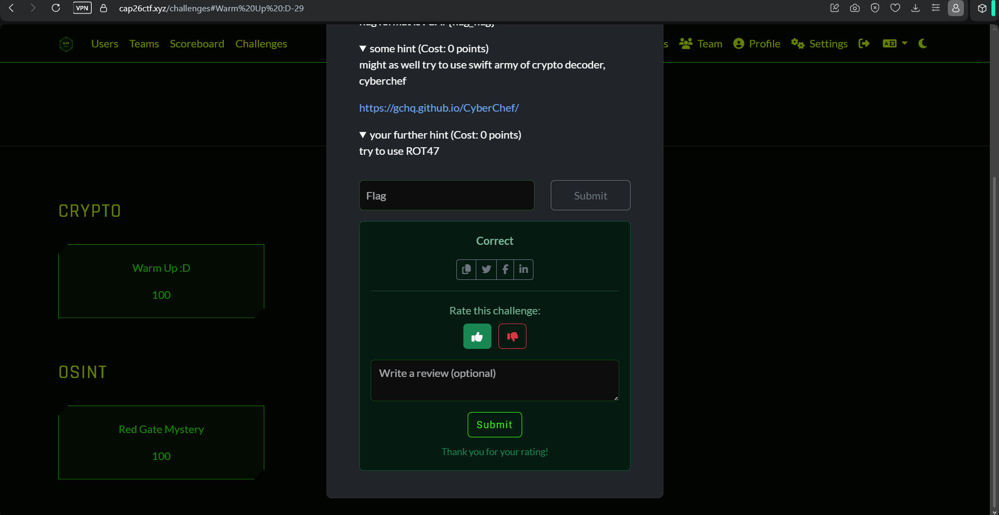
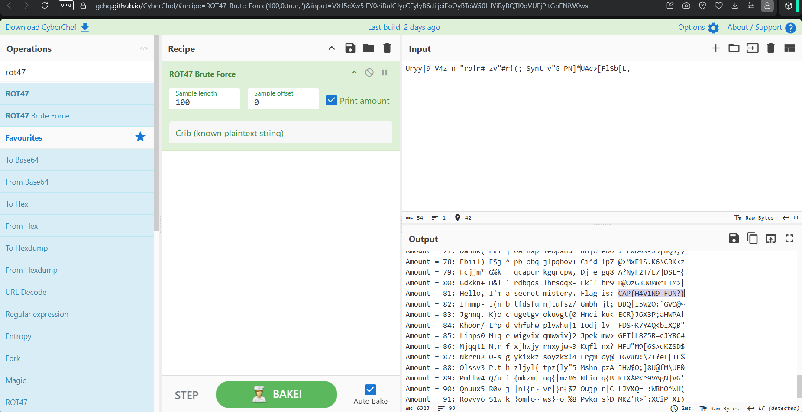

# 02 - Warm Up :D

**Category:** Cryptography
**Points:** 100
**Platform:** cap26ctf.xyz
**Flag:** `CAP{H4V1N9_FUN?}`

## Challenge Description

> Flag format is `CAP{flag_flag}`

The challenge shipped a block of ciphertext with no explicit hint about the cipher
used. Two optional (free) hints were available:



- **Hint 1 (0 points):** "might as well try to use swift army of crypto decoder,
  cyberchef" — a pointer to [CyberChef](https://gchq.github.io/CyberChef/).
- **Hint 2 (0 points):** "try to use ROT47".

## Approach

- ROT47 is a variant of the classic Caesar/ROT13 shift, but applied over the full
  printable ASCII range (`!` through `~`) instead of just the letters, which is why
  the ciphertext looked like a wall of punctuation and symbols rather than readable
  garbled text.
- Rather than guessing the exact shift, I used CyberChef's **ROT47 Brute Force**
  operation, which tries every rotation amount (0–100) against the ciphertext and
  prints each candidate plaintext side by side.
- Scrolling through the brute-force output, one amount produced clean, readable
  English ("Hello, I'm a secret mistery. Flag is: ...") — an unmistakable signal
  that the correct rotation had been found.



## Flag

```
CAP{H4V1N9_FUN?}
```
