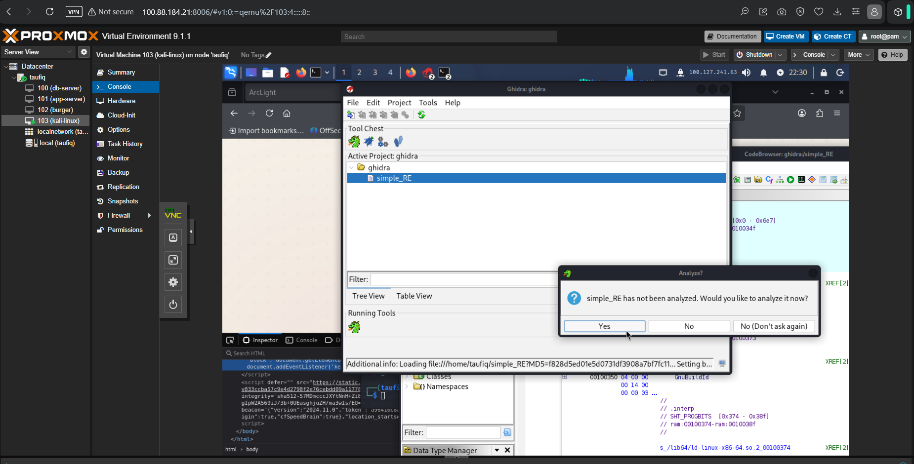
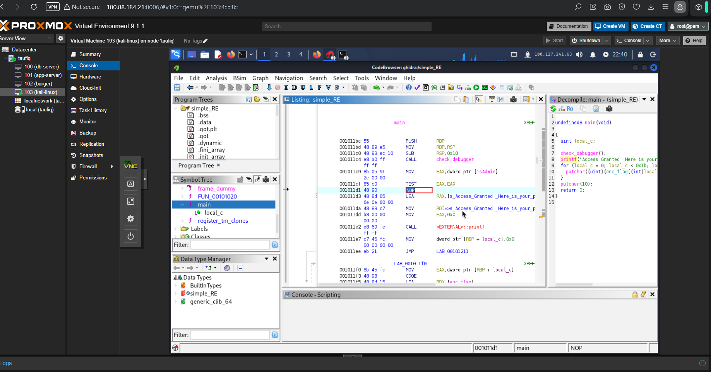
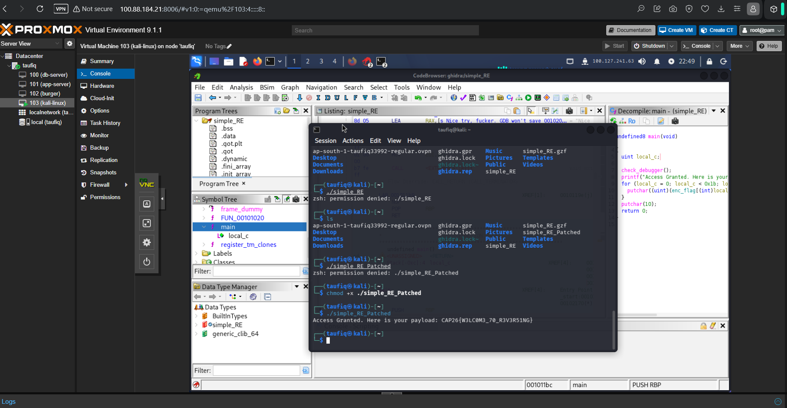

# 03 - simple_RE

**Category:** Reverse Engineering
**Platform:** cap26ctf.xyz
**Environment:** Kali Linux VM (Proxmox VE), Ghidra
**Flag:** `CAP26{W3LC0M3_70_R3V3R51NG}`

## Setup

The lab environment for this track was a Kali Linux VM hosted on a Proxmox VE
node, accessed through the browser-based console. The target binary,
`simple_RE`, was opened as a fresh project in Ghidra for static analysis.



## Approach

- After Ghidra's auto-analysis finished, the **Decompile** view for `main` showed
  the program's logic clearly:

  ```c
  undefined8 main(void)
  {
    uint local_c;

    check_debugger();
    printf("Access Granted. Here is your ...");
    for (local_c = 0; local_c < 0x1b; local_c = local_c + 1) {
      putchar((uint)(enc_flag[(int)local_c] ...));
    }
    putchar(10);
    return 0;
  }
  ```

- The very first thing `main` does is call `check_debugger()`. Below it in the
  listing, right after the `TEST EAX,EAX` that checks the debugger flag, sits a
  conditional jump (`JNZ`) that skips straight over the branch which prints the
  flag — meaning the flag-printing code only runs if `check_debugger()` reports
  that **no** debugger is attached, and the intended path otherwise dead-ends.

  

- Rather than trying to defeat the anti-debug check at runtime, the simplest fix
  was a static binary patch: NOP out the conditional jump instruction that the
  debugger check controls, so the flag-printing branch always executes
  regardless of what `check_debugger()` returns.
- After patching, the binary was saved as `simple_RE_Patched`, made executable,
  and run directly from the VM's terminal:

  ```
  $ chmod +x ./simple_RE_Patched
  $ ./simple_RE_Patched
  Access Granted. Here is your payload: CAP26{W3LC0M3_70_R3V3R51NG}
  ```

  

## Flag

```
CAP26{W3LC0M3_70_R3V3R51NG}
```
