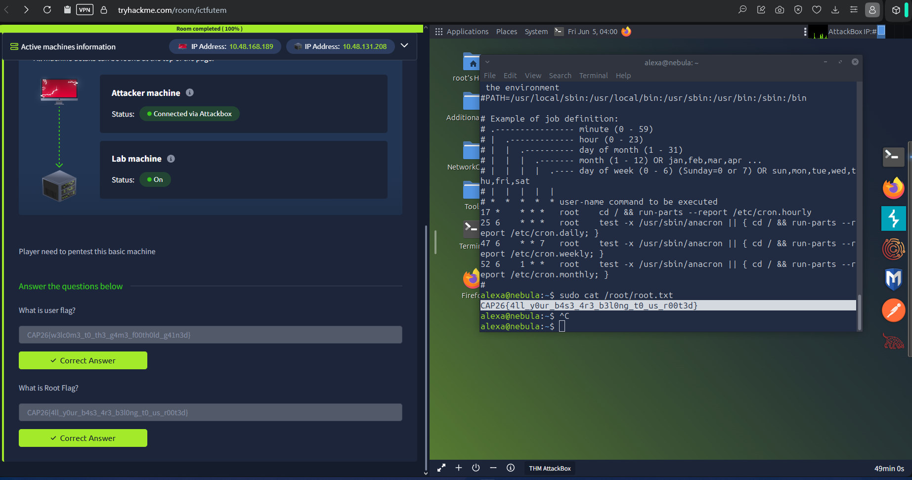

# 05 - ICTFUTeM (Pentest track)

**Category:** Penetration Testing
**Platform:** TryHackMe (`tryhackme.com/room/ictfutem`)
**Target user:** `alexa@nebula`
**User flag:** `CAP26{w3lc0m3_t0_th3_g4m3_f00th0ld_g41n3d}`
**Root flag:** `CAP26{4ll_y0ur_b4s3_4r3_b3l0ng_t0_us_r00t3d}`

## Note on scope

This screenshot was captured after the box had already been fully rooted, so
the initial-access chain (how the `alexa` shell was first obtained) wasn't
recorded on the day and isn't reconstructed here. What follows is exactly
what the surviving evidence shows.

## What the evidence shows

The AttackBox terminal, connected to the lab machine over the room's VPN,
shows the tail end of the engagement: a `cat /etc/crontab` (general
enumeration of scheduled jobs on the box) immediately followed by:

```
alexa@nebula:~$ sudo cat /root/root.txt
CAP26{4ll_y0ur_b4s3_4r3_b3l0ng_t0_us_r00t3d}
```

`sudo` running `cat /root/root.txt` without a password prompt indicates
`alexa` had a `sudo` privilege (very likely a `NOPASSWD` entry surfaced by
`sudo -l` during enumeration) that permitted running that command as root,
which was enough to read the root flag directly without needing a full
shell-spawning GTFOBins technique.



Both the user flag and root flag fields on the room's question page are
shown already submitted and accepted (green "Correct Answer" state), with
the room itself reporting **100% completion**.

## Flags

```
User: CAP26{w3lc0m3_t0_th3_g4m3_f00th0ld_g41n3d}
Root: CAP26{4ll_y0ur_b4s3_4r3_b3l0ng_t0_us_r00t3d}
```
