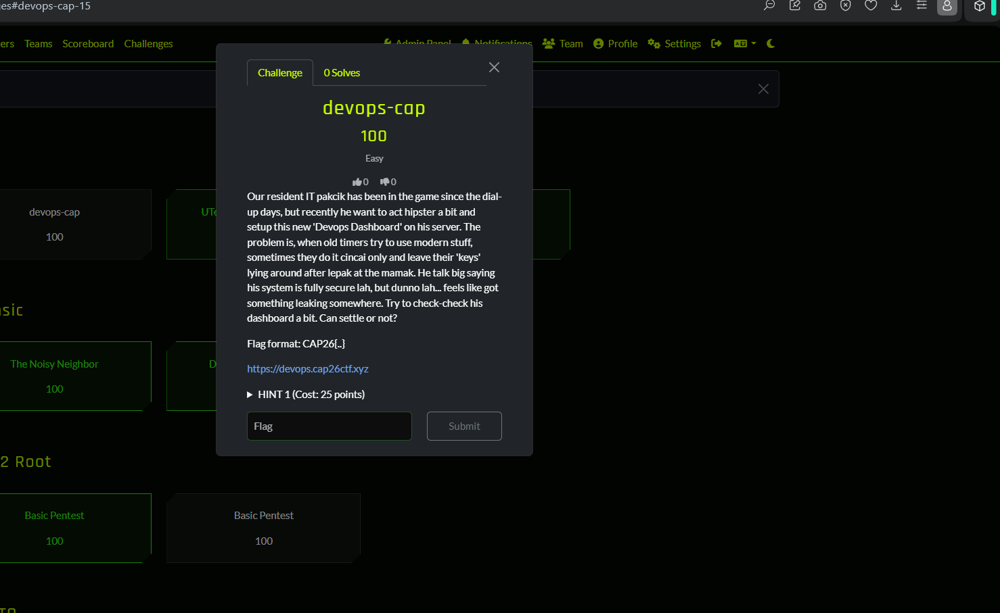

# 07 - devops-cap

**Category:** (uncategorised on the board)
**Points:** 100
**Difficulty:** Easy
**Platform:** cap26ctf.xyz
**Status:** Attempted, not solved on the day

## Challenge Description

> Our resident IT pakcik has been in the game since the dial-up days, but
> recently he want to act hipster a bit and setup this new 'Devops Dashboard'
> on his server. The problem is, when old timers try to use modern stuff,
> sometimes they do it cincai only and leave their 'keys' lying around after
> lepak at the mamak. He talk big saying his system is fully secure lah, but
> dunno lah... feels like got something leaking somewhere. Try to check-check
> his dashboard a bit. Can settle or not?
>
> Flag format: `CAP26{...}`
> Target: `https://devops.cap26ctf.xyz`

## Notes

Picked up late in the evening after the rest of the day's tracks were
finished. The flavour text points at a DevOps-themed web dashboard leaking
credentials or secrets ("keys lying around") — likely an exposed
`.git` directory, a misconfigured CI/CD config file, or a leaked API token
somewhere on `devops.cap26ctf.xyz`. This challenge wasn't completed before
the CTF window closed, so no flag was captured.
