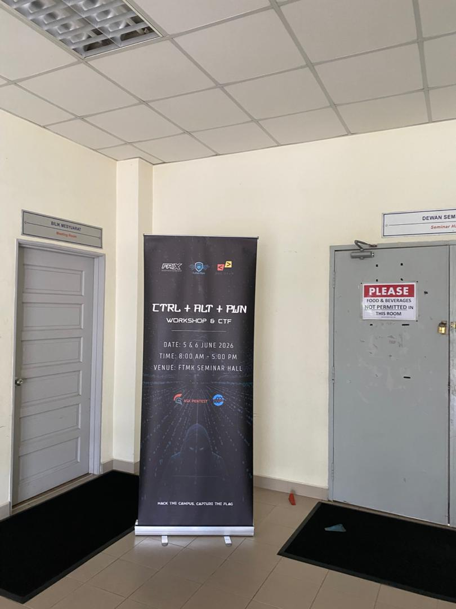
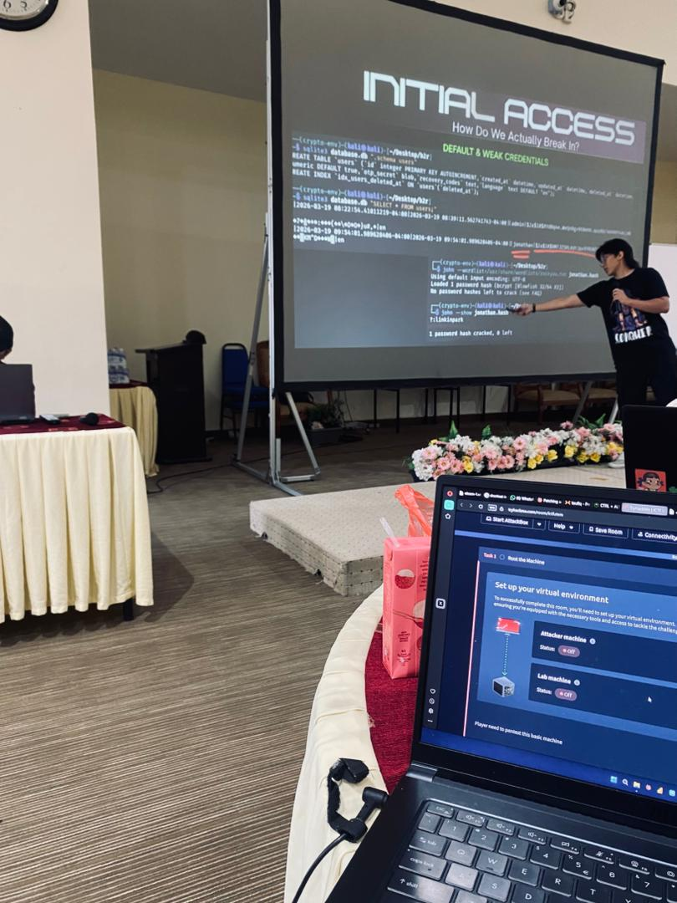

# CTRL + ALT + PWN — Workshop & CTF

- **Event:** CTRL + ALT + PWN — Workshop & CTF ("Hack the Campus, Capture the Flag")
- **Organizer:** CyberOps Club UTeM x DSC (Developer Student Clubs) UTeM, with FRIX and ASX Pentest
- **Format:** Jeopardy-style CTF (platform `cap26ctf.xyz`, CTFd) on day 1, plus a live in-person workshop; flag format `CAP26{...}`
- **Date:** 5 & 6 June 2026, 8:00 AM – 5:00 PM
- **Venue:** FTMK Seminar Hall, Universiti Teknikal Malaysia Melaka (UTeM)

This was a one-day, multi-track workshop that walked through OSINT, cryptography,
reverse engineering, digital forensics, and penetration testing, each followed by a
short hands-on CTF challenge on the `cap26ctf.xyz` CTFd instance so the material could
be applied immediately. The write-ups below are sequenced in the order the tracks were
actually worked through on 5 June 2026.

## Sequence of the day

| # | Track | Challenge | Category | Points | Result | Write-up |
|---|---|---|---|---|---|---|
| 01 | OSINT | Red Gate Mystery | OSINT | 100 | Solved | [RedGateMystery](./01-RedGateMystery/) |
| 02 | Cryptography | Warm Up :D | Crypto | 100 | Solved | [WarmUp](./02-WarmUp/) |
| 03 | Reverse Engineering | `simple_RE` | Reverse Engineering | — | Solved | [SimpleRE](./03-SimpleRE/) |
| 04 | Digital Forensics | Filter the noise, find the gold | Forensics | — | Solved | [FilterTheNoise](./04-FilterTheNoise/) |
| 05 | Penetration Testing | ICTFUTeM (TryHackMe room) | Pentest | — | Rooted | [ICTFUTeM-Pentest](./05-ICTFUTeM-Pentest/) |
| 06 | CTF board (afternoon) | Archlight | — | 100 | Solved | [Archlight](./06-Archlight/) |
| — | Talk | "Initial Access — How Do We Actually Break In?" | — | — | Attended | see below |
| 07 | CTF board (after hours) | devops-cap | — | 100 (Easy) | Attempted | [DevOpsCap](./07-DevOpsCap/) |

## The "Initial Access" talk

In the afternoon, a speaker walked through **default and weak credential attacks** —
enumerating a SQLite user table, dumping password hashes, and cracking a weak bcrypt
hash with `hashcat`/`john` to recover the plaintext password in seconds. It framed the
rest of the day's hands-on tracks around one theme: most real-world initial access
doesn't need a 0-day, it needs a reused or weak password.

## Notes on methodology

Every write-up below documents exactly what was captured on the day — screenshots,
terminal output, and the recovered flags. Where a step wasn't screenshotted (for
example the very first moves on the pentest room before it was already rooted), the
write-up says so explicitly rather than reconstructing a chain that wasn't actually
recorded.
