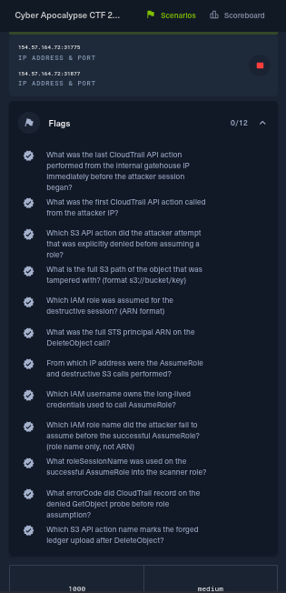

# 06 - False Order

**Category:** Cloud
**Points:** 1000
**Difficulty:** Medium
**Solved:** 28/07/2026 20:06
**Flags:** 12/12



**Approach & tooling note:**

- I used Claude Code as a supporting/execution aid on this one:
  - Probing the two exposed ports to work out which one was the AWS-compatible API endpoint versus the credential-delivery briefing page.
  - Driving the AWS CLI against the challenge's endpoint.
  - Writing a short Python script to paginate and parse the full `lookup-events` output into a sortable timeline (609 CloudTrail events is not something you want to eyeball page by page).
- The actual investigative calls were mine:
  - Which S3 object version was the "real" one.
  - Which source IP was the internal gatehouse system versus the attacker.
  - Why the attacker's choice of `roleSessionName` mattered.
  - Which of the three `AssumeRole` calls was the one that actually succeeded.
- I cross-checked every answer against the raw `CloudTrailEvent` JSON (not just the summary fields) before treating it as final. Happy to walk through this live if asked.

## Challenge Description

> Caldrin Vowmark reaches an Ashguard checkpoint with a sealed order that
> tells Stormbound's soldiers to leave the east gate and report to
> Crownspire. The officer in charge believes the order came from Garran
> Voss, and he will move his soldiers as soon as the seal is checked. If
> they leave, Vaultrune can take the gate before help arrives. Caldrin
> knows Garran's orders carry small marks that copyists miss. He has to
> inspect the order, show the officer that it is false, and stop the unit
> from leaving before Vaultrune's soldiers reach the gate.

**Decoding the flavor text first:**

| Flavor text | Likely means |
|---|---|
| "sealed order ... tells soldiers to leave the east gate" | A document/record whose content authorizes some action - a config or custody object in cloud storage. |
| "small marks that copyists miss" | A subtle field-level change between two versions of the same object - i.e. an object-versioning diff. |
| "who changed it" | The challenge wants attribution - which identity/session made the change, not just what changed. |

- The actual briefing page (served on the second port, once I found it) dropped the lore entirely and just told me outright:
  - Read-only investigator access to CloudTrail trail `coalition-gate-audit-trail`.
  - Versioned bucket `ashguard-order-custody`.
  - Start at `custody/east-gate-order.json`, correlate its version history with the audit events.
- So this is an S3-versioning-plus-CloudTrail attribution exercise, dressed up in Salt Crown lore.

## Step 1 - Working out which port is which

- The instance card gave two `IP:PORT` pairs with no other labels. I probed both before assuming anything:

```
$ curl -sI http://<ip>:<port-A>/
HTTP/1.0 501 Unsupported method ('HEAD')
Server: SaltCrownBriefing/1.0 Python/3.12.13

$ curl -s http://<ip>:<port-B>/
{"__type":"AccessDeniedException","message":"User is not authorized to perform: MissingAuthentication"}
```

- Port A serves a small custom Python webserver (`SaltCrownBriefing`) - that's the human-facing briefing page.
- Port B returns a raw AWS-shaped JSON error (`MissingAuthentication`) with `x-amzn-RequestId` headers - that's a LocalStack-style AWS API endpoint expecting SigV4-signed requests.
- The briefing page itself confirms this split explicitly: *"Point `AWS_ENDPOINT_URL` at the instance IP and the AWS API port from your instance card, not the briefing port in the address bar."*
- Fetching `/player-creds.json` from the briefing port handed me an access key/secret for an IAM user called `gate-investigator`:

```
$ curl -s http://<ip>:<briefing-port>/player-creds.json
{
  "user": "gate-investigator",
  "access_key_id": "AKIALYP8AGZBNGS026KM",
  "secret_access_key": "2chardDmQVEoIQk5jbgiMXn/ILl3StaQ3yxD7WL4",
  "region": "us-east-1",
  "endpoint": "http://127.0.0.1:4566"
}
```

- Pointed the AWS CLI at the real API port instead of the placeholder `127.0.0.1:4566` in that JSON, and confirmed identity:

```
$ export AWS_ENDPOINT_URL=http://<ip>:<api-port>
$ export AWS_DEFAULT_REGION=us-east-1
$ export AWS_ACCESS_KEY_ID=AKIALYP8AGZBNGS026KM
$ export AWS_SECRET_ACCESS_KEY=2chardDmQVEoIQk5jbgiMXn/ILl3StaQ3yxD7WL4
$ unset AWS_SESSION_TOKEN
$ aws sts get-caller-identity
{
    "UserId": "AIDA97039XTQA0AGI91C",
    "Account": "638291047582",
    "Arn": "arn:aws:iam::638291047582:user/gate-investigator"
}
```

## Step 2 - Diffing the object's version history

- The briefing named the exact object, so I went straight for its version history rather than a bucket-wide listing (which was denied anyway - `gate-investigator` doesn't have `s3:ListAllMyBuckets`, only scoped access to this one key):

```
$ aws s3api list-object-versions --bucket ashguard-order-custody \
    --prefix custody/east-gate-order.json
{
    "Versions": [
        {"VersionId": "794e8fc1-...", "IsLatest": true,  "LastModified": "2026-07-29T00:00:11Z"},
        {"VersionId": "9e085367-...", "IsLatest": false, "LastModified": "2026-07-29T00:00:05Z"}
    ],
    "DeleteMarkers": [
        {"VersionId": "99cbe3c1-...", "LastModified": "2026-07-29T00:00:11Z"}
    ]
}
```

- The delete marker and the "latest" version share the same timestamp (`00:00:11Z`) - meaning someone deleted the object (creating the delete marker) and immediately uploaded a replacement on top of it, all within the same second.
- That's the shape of a deliberate swap, not an edit. Pulling both real versions and diffing them:

```
$ aws s3api get-object --bucket ashguard-order-custody \
    --key custody/east-gate-order.json \
    --version-id 9e085367-f74c-486b-a727-bffecc29d174 order-v1.json
$ aws s3api get-object --bucket ashguard-order-custody \
    --key custody/east-gate-order.json order-current.json   # IsLatest version
$ diff order-v1.json order-current.json
```

```diff
-  "total_units": 1840,
-  "custody_status": "SEALED",
-  "order_status": "PENDING_APPROVAL",
-  "witness_line": "The gatehouse clerk attested the sealed order before dawn watch.",
-  "ledger_hash": "sha256:...a4"
+  "total_units": 920,
+  "custody_status": "RELEASED",
+  "order_status": "RELEASED",
+  "witness_line": "Gate release authorized per emergency writ WR-4412; witness attestation waived.",
+  "ledger_hash": "sha256:...a5"
```

- That's the forged "false order" from the scenario text:
  - The real record was `SEALED` / `PENDING_APPROVAL`.
  - The object that replaced it claims `RELEASED` under a fabricated "emergency writ" with attestation conveniently waived.
  - Even the `ledger_hash` was hand-edited by one trailing hex character (`...a4` -> `...a5`) rather than genuinely recomputed - exactly the kind of "small mark a copyist misses" the scenario text points at.

**Flag 4 - full S3 path of the tampered object:**
```
s3://ashguard-order-custody/custody/east-gate-order.json
```

## Step 3 - Pulling and sorting the full CloudTrail history

- `lookup-events` paginates in batches of 50 with a `NextToken`. Rather than click through pages by hand, I scripted full pagination and sorted everything chronologically:

```python
import subprocess, json

all_events, token = [], None
while True:
    cmd = ["aws", "cloudtrail", "lookup-events", "--max-results", "50"]
    if token:
        cmd += ["--starting-token", token]
    out = json.loads(subprocess.run(cmd, capture_output=True, text=True).stdout)
    all_events.extend(out["Events"])
    token = out.get("NextToken")
    if not token:
        break
# 609 events total
```

- (In hindsight, `--max-items 1000` on a single `aws cloudtrail lookup-events` call auto-paginates through botocore's own paginator and gets the same 609 events in one shot - I hand-rolled the loop first and only found the shortcut afterward.)
- Grouping by `sourceIPAddress` immediately separated the actors - this was the single most useful pivot in the whole investigation:

| Source IP | Identity seen | Event count | Time range |
|---|---|---|---|
| `10.41.53.22` | `coalition-gate-clerk` (IAM user) | 548 | 24 Jul 07:25 -> 28 Jul 21:00 |
| `198.18.44.91` | `seal-copyist-contractor`, then `assumed-role/ashguard-order-scanner/coalition-gate-clerk` | 21 | 28 Jul 21:01 -> 29 Jul 00:00 |
| `127.0.0.1` | `root` | 26 | infra/grader setup noise (`CreateTrail`, `CreateUser`, etc.) |
| `124.13.11.143` | `gate-investigator` | - | my own investigator session |

- `10.41.53.22` is clearly the legitimate internal gatehouse clerk - almost five days of steady `ListObjectsV2`/`HeadObject`/`GetObject` traffic under the real `coalition-gate-clerk` IAM user, going quiet at `21:00:07Z`.
- One minute later, a completely different IP (`198.18.44.91`) shows up calling `GetCallerIdentity` under a *different* IAM user (`seal-copyist-contractor`) it had never used before.
- That hand-off is the attacker session boundary.

**Flag 7 - IP address for the AssumeRole and destructive S3 calls:**
```
198.18.44.91
```

**Flag 8 - IAM username owning the long-lived credentials used to call AssumeRole:**
```
seal-copyist-contractor
```

## Step 4 - The last legitimate action and the attacker's opening move

```
$ # last event from 10.41.53.22 before the gap
2026-07-28T21:00:07.792Z  ListObjectsV2

$ # first event from 198.18.44.91
2026-07-28T21:01:07.415Z  GetCallerIdentity
```

**Flag 1 - last CloudTrail action from the internal gatehouse IP immediately before the attacker session began:**
```
ListObjectsV2
```

**Flag 2 - first CloudTrail action called from the attacker's IP:**
```
GetCallerIdentity
```

## Step 5 - Reconstructing the attacker's full timeline

- Filtering strictly to `198.18.44.91` and printing every event in order, with request parameters and error fields, gave the whole attack end-to-end:

```
21:01:07  GetCallerIdentity                                    (seal-copyist-contractor)
21:14:20  ListBuckets
21:26:33  ListObjectsV2   bucket=ashguard-order-custody prefix=""
21:41:09  GetObject       bucket=ashguard-order-custody key=custody/east-gate-order.json
          -> errorCode=AccessDenied
22:02:34  ListObjectsV2   prefix=custody/
22:19:06  ListObjectsV2   bucket=ashguard-intake
22:36:41  AssumeRole      roleArn=.../role/ashguard-order-auditor  session=seal-copyist-session
          -> errorCode=AccessDenied
22:55:07  ListBuckets
23:13:16  ListObjectsV2   prefix=receipts/
23:23:23  ListObjectsV2   bucket=ashguard-order-archive
23:41:55  ListObjectsV2   prefix=custody/
00:00:10.632  GetCallerIdentity
00:00:10.825  ListObjectsV2   bucket=ashguard-order-custody
00:00:10.885  GetObject       key=custody/east-gate-order.json
              -> errorCode=AccessDenied, "User is not authorized to perform: s3:GetObject"
00:00:10.917  AssumeRole      roleArn=.../role/ashguard-order-auditor  session=coalition-gate-clerk
              -> errorCode=AccessDenied, "... is not authorized to perform: sts:AssumeRole on resource: .../role/ashguard-order-auditor"
00:00:10.931  AssumeRole      roleArn=.../role/ashguard-order-scanner  session=coalition-gate-clerk
              -> SUCCESS, assumedRoleUser.arn = arn:aws:sts::638291047582:assumed-role/ashguard-order-scanner/coalition-gate-clerk
00:00:11.144  GetCallerIdentity                                    (now as the assumed role)
00:00:11.220  ListBucketVersions  prefix=custody/east-gate-order.json
00:00:11.234  DeleteObject        key=custody/east-gate-order.json
00:00:11.287  PutObject           key=custody/east-gate-order.json   <- the forged replacement
```

- Two things stood out immediately:
  - The attacker tried a direct `GetObject` on the order and got denied *before* ever calling `AssumeRole` - meaning the read-only `seal-copyist-contractor` user genuinely can't touch this object on its own, so escalation was necessary, not optional.
  - There are **three** `AssumeRole` calls total, not one:
    - An early exploratory attempt at `21:36:41` (role `ashguard-order-auditor`, session name `seal-copyist-session`) that failed.
    - Right at the very end, seconds before the destructive calls, a second attempt at the *same* `ashguard-order-auditor` role (this time with session name `coalition-gate-clerk`, clearly trying to impersonate the legitimate clerk's identity in the audit trail) that also failed.
    - Immediately followed by a third attempt against a *different* role, `ashguard-order-scanner`, which succeeded.

**Flag 3 - S3 API action the attacker attempted that was explicitly denied before assuming a role:**
```
GetObject
```

**Flag 11 - errorCode CloudTrail recorded on the denied GetObject probe before role assumption:**
```
AccessDenied
```

**Flag 9 - IAM role name the attacker failed to assume before the successful AssumeRole (role name only):**
```
ashguard-order-auditor
```

**Flag 5 - IAM role assumed for the destructive session (ARN format):**
```
arn:aws:iam::638291047582:role/ashguard-order-scanner
```

**Flag 10 - roleSessionName used on the successful AssumeRole into the scanner role:**
```
coalition-gate-clerk
```

- That reused session name is the sharpest detail in the whole trail:
  - The attacker deliberately set `roleSessionName=coalition-gate-clerk` on the role they *did* get into, so that the resulting STS principal ARN in every subsequent CloudTrail event - `arn:aws:sts::...:assumed-role/ashguard-order-scanner/coalition-gate-clerk` - visually echoes the legitimate clerk's name, even though the actual long-lived identity behind it is `seal-copyist-contractor`.
  - If you only skim the `userIdentity.arn` field and don't check the access key ID or the calling IP, this session name is built to make you misattribute the destructive calls to the real clerk.

## Step 6 - The destructive calls

- The three calls made under the assumed role, in order: `ListBucketVersions` (confirming the current version to target), `DeleteObject` (creating the delete marker seen in Step 2), and `PutObject` (uploading the forged `RELEASED` document).
- Both destructive calls carry the same STS principal:

```json
"userIdentity": {
  "type": "AssumedRole",
  "arn": "arn:aws:sts::638291047582:assumed-role/ashguard-order-scanner/coalition-gate-clerk",
  "accessKeyId": "ASIAG0KTW06FCCF0LSBC"
}
```

**Flag 6 - full STS principal ARN on the DeleteObject call:**
```
arn:aws:sts::638291047582:assumed-role/ashguard-order-scanner/coalition-gate-clerk
```

**Flag 12 - S3 API action name marking the forged ledger upload after DeleteObject:**
```
PutObject
```

## Answer summary

| # | Question | Answer |
|---|---|---|
| 1 | Last action from internal gatehouse IP before attacker session | `ListObjectsV2` |
| 2 | First action from attacker's IP | `GetCallerIdentity` |
| 3 | Denied S3 action before role assumption | `GetObject` |
| 4 | Tampered object, full S3 path | `s3://ashguard-order-custody/custody/east-gate-order.json` |
| 5 | Assumed IAM role (ARN) | `arn:aws:iam::638291047582:role/ashguard-order-scanner` |
| 6 | STS principal ARN on DeleteObject | `arn:aws:sts::638291047582:assumed-role/ashguard-order-scanner/coalition-gate-clerk` |
| 7 | IP for AssumeRole + destructive calls | `198.18.44.91` |
| 8 | IAM username owning long-lived creds | `seal-copyist-contractor` |
| 9 | Role name failed before success | `ashguard-order-auditor` |
| 10 | roleSessionName on successful AssumeRole | `coalition-gate-clerk` |
| 11 | errorCode on denied GetObject probe | `AccessDenied` |
| 12 | S3 action marking forged upload after DeleteObject | `PutObject` |

## Methodology takeaways for next time

- **When an instance card gives two `IP:PORT` pairs with no labels, probe both before assuming which is which.** A plain `curl -sI` against each is enough - a raw AWS-shaped JSON error with `x-amzn-RequestId` headers on an unauthenticated request is a dead giveaway you've found the API endpoint, not the UI.
- **A delete marker and a new object version sharing the same timestamp is the signature of a deliberate swap**, not an innocent edit - worth checking `list-object-versions` for delete markers even when the question only asks about "tampering."
- **Group CloudTrail events by `sourceIPAddress` before anything else.** It's the fastest way to separate legitimate long-running service/user traffic from a short, bursty session that starts right after the legitimate one goes quiet.
- **Don't assume `AssumeRole` is a single event just because you found one destructive session.** Check for *all* calls to that action - failed attempts against a different role name are often the more interesting artifact, showing what the attacker wanted but couldn't get, versus what they settled for.
- **A `roleSessionName` is attacker-controlled and shows up verbatim in every subsequent event's `userIdentity.arn`.** Never attribute an assumed-role session to a person by session name alone - always cross-check the calling IP and, where available, the `accessKeyId` behind the assumption, since an attacker can deliberately pick a session name that impersonates a legitimate identity in the log.
- **`aws cloudtrail lookup-events --max-items N`** auto-paginates through botocore's built-in paginator in a single call - no need to hand-roll a `NextToken` loop unless you want per-page control.

## If asked to explain this live

- This was an S3-object-tampering-plus-CloudTrail-attribution challenge.
- I got read-only investigator credentials pointed at a LocalStack-style AWS API endpoint (found by probing both instance ports and picking the one returning raw AWS JSON errors), and access to a versioned S3 bucket plus a CloudTrail trail.
- `list-object-versions` on the order document showed a delete marker and a replacement version created in the same second, and diffing the two real versions showed the record had been flipped from `SEALED`/`PENDING_APPROVAL` to a forged `RELEASED` status citing a fake emergency writ, with even the `ledger_hash` hand-edited by one hex character.
- I then paginated all 609 CloudTrail events and grouped them by source IP, which cleanly separated five days of legitimate clerk traffic from a short attacker session starting exactly one minute after the clerk's last call.
- The attacker started as IAM user `seal-copyist-contractor`, got denied on a direct `GetObject`, tried and failed to assume an `ashguard-order-auditor` role twice (the second attempt using the session name `coalition-gate-clerk`, apparently to make the resulting principal ARN look like the real clerk), then succeeded assuming a different role, `ashguard-order-scanner` - still under that same spoofed session name - and used it to `DeleteObject` the real order and `PutObject` the forged one, all within roughly half a second.
