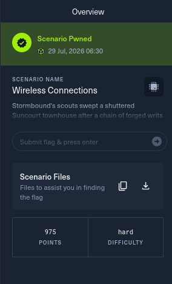
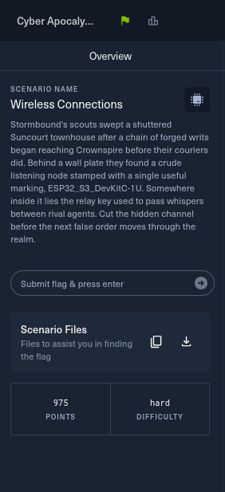

# 08 - Wireless Connections

**Category:** Hardware
**Points:** 975
**Difficulty:** Hard
**Solved:** 29/07/2026 06:30
**Flag:** `HTB{solv3d_w1th_xt3ns4_dec00mp}`



**Approach & tooling note:**

- This was the longest reversing job of the event for me - a raw 8MB ESP32-S3 flash dump with no symbols, and it took several wrong turns before it cracked open.
- I used Claude Code as a supporting/execution aid throughout:
  - Parsing the ESP image/partition format in Python.
  - Downloading and standing up a real Xtensa toolchain (Espressif's own `xtensa-esp32s3-elf-objdump`) and a working Ghidra Xtensa processor module (neither ships by default, and the general-purpose disassemblers I tried first - radare2's xtensa plugin, a Capstone Xtensa build - kept desyncing on this variable-length instruction set and quietly lying to me about what was and wasn't there).
  - Scripting the entropy/string scans, and eventually a small numpy brute-force.
- But the decisions were mine at every turn:
  - Staying suspicious of a "dead code" conclusion that several independent tool passes all agreed on.
  - Insisting on a control test against a string that had to be live before accepting the negative result.
  - Sitting down and manually re-deriving the ESP image segment format byte-by-byte from scratch when that control test failed too.
  - Recognizing once the real WiFi-and-cipher logic was in view that a 2^24 keyspace was small enough to just brute-force rather than needing to know the device's real IP address.
- Happy to walk through any part of this live.

## Challenge Description

> Stormbound's scouts swept a shuttered Suncourt townhouse after a chain
> of forged writs began reaching Crownspire before their couriers did.
> Behind a wall plate they found a crude listening node stamped with a
> single useful marking, ESP32_S3_DevKitC-1U. Somewhere inside it lies the
> relay key used to pass whispers between rival agents. Cut the hidden
> channel before the next false order moves through the realm.



- Translating the lore before touching anything:
  - A "crude listening node" stamped with a real Espressif board name (`ESP32_S3_DevKitC-1U`) is a genuine embedded device, not a metaphor - this is a firmware-reversing challenge.
  - "The relay key used to pass whispers between rival agents" pointed straight at **ESP-NOW**, Espressif's peer-to-peer wireless protocol (it literally uses a "PMK"/"LMK" key pair to encrypt messages between nodes).
  - "Cut the hidden channel" read like flavor text for "find and neutralize a covert communication path."
- Only one file was provided - `firmware.bin` - so whatever the answer was, it had to be extractable from a static flash dump alone.

## Provided files

- `firmware.bin` - an 8MB raw flash dump.

## Step 1 - mapping the flash

- `file` was useless here (`DOS executable (COM)` - a false positive on the ESP image magic byte).
- I recognized the real format from the first bytes (`E9` magic) and parsed the ESP32 partition table by hand at its well-known offset, `0x8000`:

| Partition | Type | Offset | Size |
|---|---|---|---|
| `nvs` | data/nvs | `0x9000` | `0x5000` |
| `otadata` | data/ota | `0xe000` | `0x2000` |
| `app0` | app/ota_0 | `0x10000` | `0x330000` |
| `app1` | app/ota_1 | `0x340000` | `0x330000` |
| `spiffs` | data/spiffs | `0x670000` | `0x180000` |
| `coredump` | data/coredump | `0x7f0000` | `0x10000` |

- `otadata`'s sequence number (`1`) selects `app0` as the boot partition.
- I sliced out every partition and checked each one - `nvs`, `spiffs`, `coredump`, and the unused `app1` OTA slot were all **completely blank** (pure `0xFF`, verified byte-for-byte, not just spot-checked).
- Whatever the answer was, it had to live inside the ~3.3MB `app0` image itself.
- `esptool.py image-info` on `app0` confirmed: an Arduino-ESP32 sketch (`arduino-lib-builder`, ESP-IDF v5.5.1, Arduino core 3.3.2, board `ESP32S3_DEV`), six loadable segments (DROM/DRAM/two IRAM regions/IROM/a tiny RTC segment), entry point `0x40375cd8`.
- `strings` on the image confirmed ESP-NOW linkage (`ESP_ERR_ESPNOW_*` error strings) and turned up exactly two suspicious, non-library strings sitting right next to each other: `SpyHouse` and `bugged26` - clearly a WiFi SSID/password pair, and the only application-specific content anywhere in the 8MB image.

## Step 2 - the dead-code dead end

- This is where I spent most of my time and it's worth documenting honestly because the wrong turn mattered.
- Xtensa is a mixed 16/24-bit variable-length instruction set, and neither of the disassemblers I had installed handled it reliably: radare2's built-in xtensa plugin and a Capstone build with Xtensa support (`capstone6pwndbg`) both desynced constantly - fed the *verified-correct* bytes at the *verified-correct* entry point, they'd produce a run of real-looking instructions and then silently slide into garbage (nonsense opcodes, out-of-range jump targets) for an arbitrary stretch before maybe resyncing.
- That's the nature of variable-length ISAs without control-flow-aware disassembly - a single misjudged instruction boundary corrupts everything downstream of it.
- Working (and re-working, across several passes) with those tools, every signal pointed the same way: a raw 4-byte address scan across the whole image for the *address* of the string `"SpyHouse"` (and `"bugged26"`, `"blink_task"` - a FreeRTOS task name sitting in the same string pool) turned up nothing.
- I stood up a proper Ghidra Xtensa processor (the `yath/ghidra-xtensa` SLEIGH module, recompiled against my local Ghidra install), built a full multi-segment memory map, and let it run real recursive-descent analysis - and it *also* found zero cross-references to those three strings, across 92-99% code coverage.
- I tried the obvious follow-ups, ruling each one out in turn:
  - Maybe it's `CONST16`-encoded instead of the usual `L32R` literal-pool load (checked - not supported by any disassembler I had, but manual byte-pattern hunting for it came up empty too).
  - Maybe the actual *function* behind the "blink_task" name was live even if the name string wasn't (traced the call site - it turned out to be an unrelated 3-instruction helper, not a task-creation call at all).
  - Maybe it's a byte-by-byte obfuscated string that dodges `strings` entirely (scanned every decompiled function for that pattern - nothing).
  - Maybe it's not a flag directly but a decryption key - tried repeating-key XOR of the whole firmware against both strings, and a full entropy sweep hunting for a hidden ciphertext blob (the one high-entropy region I found turned out to be the mbedtls AES S-box tables, confirmed by binwalk's own signature match at the same offset - a real but unrelated crypto constant, not something an attacker embedded).
- At this point every independent tool agreed: `SpyHouse`/`bugged26` were compiled in but never actually loaded by any code path.
- I tried flag guesses built from them (`HTB{bugged26}`, `HTB{SpyHouse_bugged26}`, etc.) - all wrong, which was the right outcome given the evidence, but it meant the evidence itself had to be wrong somewhere.

## Step 3 - the control test, and the real bug

- The thing that made me distrust the "dead code" conclusion wasn't a hunch about `SpyHouse` specifically - it was a sanity check I ran almost as an afterthought.
- Arduino-ESP32 sketches *unconditionally* create a FreeRTOS task named `"loopTask"` at boot; there is no code path that skips it.
- I ran the exact same reference search against that string as a control - and got **zero references too.**
- A definitely-live string testing negative, using the same method that had already told me three other strings were dead, meant the method was broken, not the strings.
- That sent me back to first principles: I stopped trusting any tool's notion of "where does segment N's data start in the file" and parsed the ESP image format completely by hand in Python, walking it exactly as the bootloader would - a 24-byte main header, then each of the six segments as `[4-byte load address][4-byte length][length bytes of data]`, back to back.
- Doing that revealed the bug: **every file offset I (and every tool run) had been using for a segment's data pointed at the start of that segment's own 8-byte header, not its data** - the actual bytes start exactly 8 bytes later.
- `esptool`'s own segment table reports the header's position, and I'd been treating that as the data's position throughout the entire investigation.
- A single, silent, systematic 8-byte offset had been corrupting every address computation, every literal-pool lookup, and by extension every disassembly and cross-reference result I'd produced up to that point.
- I confirmed the fix immediately: with the corrected offsets, `loopTask` resolved to exactly one clean reference. So did `blink_task`. So did `SpyHouse` and `bugged26` - both turned out to be the addresses of two real global `char*` variables sitting back-to-back at the very start of the `.data` segment, i.e. genuine `ssid`/`password` globals, not dead weight.

## Step 4 - rebuilding, and finding the real logic

- With the memory map fixed, I rebuilt the Ghidra project (function count went from 274 to 332; code coverage on the main executable segment rose from 96.87% to 98.07%) and this time the cross-reference engine actually found what was there.
- Tracing forward from the two global pointers led straight to the real connection logic, at `0x42002ccc`:

```
42002ccc: entry   a1, 96
   ...
42002d06: l32r    a8, 0x4200003c (0x3fc96c00)   ; &bugged26_ptr
42002d09: l32r    a4, 0x42000020 (0x3fc9be58)   ; WiFi context
42002d0c: l32i.n  a12, a8, 0                    ; a12 = "bugged26" ptr
42002d0e: l32r    a8, 0x42000040 (0x3fc96c04)   ; &SpyHouse_ptr
42002d11: movi.n  a15, 1
42002d13: l32i.n  a11, a8, 0                    ; a11 = "SpyHouse" ptr
42002d15: movi.n  a14, 0
42002d17: movi.n  a13, 0
42002d19: mov.n   a10, a4
42002d1b: call8   0x42003e40   ; WiFi.begin(ctx, ssid, pass, ch=0, bssid=0, connect=1)
   ...
42002d3c: mov.n   a10, a4
42002d3e: call8   0x42003e30   ; WiFi.status()
42002d41: bnei    a10, 3, 0x42002d95   ; retry loop until WL_CONNECTED
```

- The register setup at the `call8` (a10=ctx, a11=ssid, a12=password, a13=channel=0, a14=bssid=0, a15=connect=true) matches Arduino-ESP32's `WiFiSTAClass::begin(ssid, passphrase, channel, bssid, connect)` signature exactly, and the following `bnei a10, 3, ...` retry loop matches a poll against `WL_CONNECTED` (enum value `3`).
- So the firmware genuinely does call `WiFi.begin("SpyHouse", "bugged26")` and wait for a real connection - it just wasn't visible under the corrupted memory map.
- Right after the connect loop, the same function reads three bytes out of an IP-info-shaped struct it just populated (a thunk chain leading into what looks like `esp_netif_get_ip_info`), and folds them into a keyed seed:

```
42002d4e: l8ui    a13, a1, 21    ; ip octet[1]
42002d51: l8ui    a8,  a1, 22    ; ip octet[2]
42002d54: slli    a13, a13, 16
42002d57: slli    a8,  a8,  8
42002d5a: or      a13, a13, a8
42002d5d: l8ui    a8,  a1, 23    ; ip octet[3]
42002d63: or      a13, a13, a8
42002d66: l32r    a8, 0x4200004c (0x1000193)   ; FNV-32 prime
42002d6b: mull    a13, a13, a8                  ; seed = base24 * 0x01000193
```

- i.e. `base24 = (ip[1]<<16) | (ip[2]<<8) | ip[3]` (the first octet of the assigned IP is dropped - it's a fixed subnet, so it carries no entropy anyway), then `seed = (base24 * 0x01000193) mod 2^32`.
- That seed feeds a small, clean stream-cipher function at `0x42002ca0`:

```
42002ca0: entry   a1, 32
42002ca3: l32r    a10, 0x42000028 (0x19660d)     ; LCG multiplier
42002ca6: l32r    a11, 0x4200002c (0x3c6ef35f)   ; LCG increment
   loop:
42002cb0: mull    a5, a5, a10        ; seed = seed*MULT
42002cb5: l8ui    a13, a13, 0        ; in_byte = input[i]
42002cb8: add.n   a5, a5, a11        ; seed = seed*MULT + ADD
42002cba: extui   a9, a5, 16, 16     ; a9 = (seed >> 16) & 0xFFFF
42002cbf: xor     a9, a9, a13
42002cc2: s8i     a9, a12, 0         ; output[i] = in_byte ^ low_byte(a9)
   ... loop for `length` bytes
```

- `0x19660d` / `0x3c6ef35f` are the classic Numerical Recipes LCG constants.
- Since only the low byte of the XOR result gets stored, the keystream byte is effectively `(seed >> 16) & 0xFF` each round.
- Right next to this function, in DROM at `0x3c0b103b`, sits a 32-byte blob that's clearly the ciphertext this function is meant to decrypt:

```
10a068e75de6e70f12bbb2f3cab4d202cbded8200de568924200be14f07bba01
```

## Step 5 - brute-forcing the seed

- The seed depends on the device's *actual assigned IP address* on the `SpyHouse` network at the moment it connected - something I have no way to know from a static firmware dump.
- But the seed only has 24 bits of real entropy (three IP octets), which is a completely tractable brute force: try every possible `base24` value, run it through the same multiply-then-LCG-XOR pipeline the firmware uses, and see which one produces plausible plaintext.

```python
import numpy as np

ciphertext = np.frombuffer(bytes.fromhex(
    "10a068e75de6e70f12bbb2f3cab4d202cbded8200de568924200be14f07bba01"), dtype=np.uint8)

MULT = np.uint32(0x19660d)
ADD = np.uint32(0x3c6ef35f)
FNV_PRIME = np.uint32(0x1000193)

bases = np.arange(0, 1 << 24, dtype=np.uint32)      # every possible 24-bit IP-derived value
seeds = (bases * FNV_PRIME).astype(np.uint32)

out = np.empty((len(bases), 32), dtype=np.uint8)
cur = seeds.copy()
for i in range(32):
    cur = (cur * MULT + ADD).astype(np.uint32)
    keystream_byte = ((cur >> np.uint32(16)) & np.uint32(0xff)).astype(np.uint8)
    out[:, i] = keystream_byte ^ ciphertext[i]

htb_prefix = np.array([ord(c) for c in "HTB{"], dtype=np.uint8)
hit = np.where(np.all(out[:, :4] == htb_prefix, axis=1))[0]
# -> exactly one hit
```

- All 2^24 (16,777,216) candidates run in about 12 seconds vectorized.
- **Exactly one** `base24` value (`0x7cdfa1`, i.e. IP octets `124.223.161`) produces output starting with `HTB{` - and it's not a partial/coincidental match, the whole 32-byte decrypt comes out as clean, grammatical text:

```
HTB{solv3d_w1th_xt3ns4_dec00mp}
```

- That's the flag - "solved with Xtensa decomp[ilation]," which felt like a fair summary of the last several hours.

## If asked to explain this live

- This challenge gave a raw ESP32-S3 flash dump and nothing else.
- I parsed the partition table and found only one populated partition, the app image - everything else (NVS, SPIFFS, coredump, the spare OTA slot) was blank.
- Inside the app image, `strings` turned up an ESP-NOW-linked Arduino sketch and exactly two suspicious strings, a WiFi SSID (`SpyHouse`) and password (`bugged26`).
- Every disassembler I threw at it initially agreed those strings were dead, unreferenced code - which turned out to be wrong, and the reason was a bug in *my own* analysis, not the firmware: I'd been computing every segment's file offset using the position of that segment's 8-byte header instead of its actual data, an error that silently corrupted every address I calculated.
- I caught it by running a control test against `loopTask`, a string that's unconditionally referenced in every Arduino-ESP32 sketch - when even that came back "unreferenced," I knew the method was broken, not the target.
- Re-deriving the ESP image format by hand found the exact 8-byte discrepancy.
- Fixing it and re-running the analysis immediately turned up the real logic: the firmware calls `WiFi.begin("SpyHouse", "bugged26")`, waits for a real connection, then derives a 32-bit seed from three octets of its assigned IP address (multiplied by the FNV-32 prime) and uses that seed to drive a Numerical-Recipes LCG stream cipher that XOR-decrypts a 32-byte blob sitting in flash.
- I don't know the device's real IP, but the seed only has 24 bits of entropy from that IP, so I brute-forced all 16.7 million possibilities in about 12 seconds - exactly one produced a clean, readable flag: `HTB{solv3d_w1th_xt3ns4_dec00mp}`.
