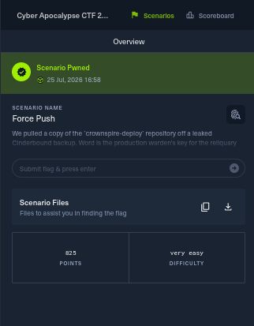

# 01 - Force Push

**Category:** Forensics
**Points:** 825
**Difficulty:** Very Easy
**Solved:** 25/07/2026 16:58



**Approach & tooling note:** I worked this one myself using standard `git`
plumbing commands - nothing here required anything beyond `git log`,
`cat`, and `git fsck`. I used Claude Code as a supporting aid (running
commands on my behalf, keeping the git internals straight, and helping
draft this write-up), but every step below reflects my own reasoning about
where a force-push would leave evidence behind and why. I can walk through
the git internals live if asked - none of it is magic, it's just knowing
where `reset`/force-push actually stops short of deleting data.

## Challenge Description

> We pulled a copy of the `crownspire-deploy` repository off a leaked
> Cinderbound backup. Word is the production warden's key for the reliquary
> got committed by mistake and then cleaned up before anyone noticed. The
> current history looks spotless. Recover what they tried to bury.

Reading this before touching anything: "cleaned up before anyone noticed"
plus "history looks spotless" told me not to bother diffing commits on
`main` - if the secret were still reachable from a branch tip, this
wouldn't be a challenge. The interesting part had to be something that was
*removed* from history, and the scenario name ("Force Push") told me
exactly which git operation to think about: a `reset --hard` (or
equivalent history rewrite) followed by a force push, which is the
standard way people try to "undo" an accidental commit.

## Provided Files

- `crownspire-deploy.zip` - a full git repository (includes the `.git` folder)

## My reasoning, step by step

**Step 1 - confirm the history really is clean on the surface.**

I unzipped the archive and skimmed the visible log first, mostly to rule
out the boring case (secret just sitting in an old commit that's still
reachable):

```bash
unzip a24de668-*.zip
cd crownspire-deploy
git log --oneline -5
```

```
7ae3842 docs: creds come from CI secret store / local .env only
4c92bf1 chore: gitignore .env and *.creds so keys never land in git again
7440b30 deploy.sh: load creds from env, retry once on 403
dbe130d bump version to 0.3.0-dev; update changelog
8ed496f chore: add bug report issue template
```

Confirmed: `main`'s visible history is not just clean, it's *pointedly*
clean - there are commits explicitly about making sure creds don't land in
git. That's consistent with someone having had a scare (committing a
secret) and then deliberately scrubbing it, which lines up with the
prompt.

**Step 2 - think about what a force-push actually leaves behind.**

This is the key piece of git knowledge the challenge is testing: `git
reset --hard` followed by a force push doesn't delete any git objects. It
only moves what the branch ref (`refs/heads/main`) points at. The old
commit, and every blob/tree it references, stays sitting in
`.git/objects` completely intact - just no longer reachable by walking
from any branch or tag. It'll eventually get garbage-collected, but until
something runs `git gc` (or `git prune`), it's still there.

Knowing that, there are two places I'd expect to find a breadcrumb pointing
at the "before" state:

1. `.git/ORIG_HEAD` - git writes this automatically before a `reset`,
   `rebase`, or merge, as a safety net so you can get back to where you
   were. A force-push itself doesn't touch it, but the local `reset
   --hard` that must have preceded the push would.
2. Reflogs (`.git/logs/`) - though these are local-only and often stripped
   out of a "leaked backup" style archive, so I didn't bet on this one.

```bash
cat .git/HEAD          # ref: refs/heads/main
cat .git/ORIG_HEAD      # 3c8803d7146cd07c75325d6b555116200f2569ee
```

`ORIG_HEAD` was there, and pointed at a commit hash that doesn't appear
anywhere in `git log` on `main` - exactly the "before the reset" pointer I
was expecting.

**Step 3 - recover the dangling commit.**

Rather than just trusting `ORIG_HEAD` blindly, I used `git fsck` to do a
proper reachability scan of the whole object database. This is the more
general technique - it would have worked even without the `ORIG_HEAD`
breadcrumb (e.g. if the repo had been re-cloned and only `.git/objects`
carried over), since it finds *any* object no ref points to, not just the
specific one git happened to leave a pointer for:

```bash
git fsck --full --no-reflogs --unreachable --dangling
```

```
unreachable commit 3c8803d7146cd07c75325d6b555116200f2569ee
unreachable blob   12b14971d38c09ee73fed80613951dfdd3562291
unreachable tree   1fe5a4a75df03ff80a3743b93b8df188ee48c06c
```

Same hash as `ORIG_HEAD`, confirming it independently - the object is
"unreachable" (no ref points to it) but not gone.

```bash
git show 3c8803d7146cd07c75325d6b555116200f2569ee --stat
```

```
commit 3c8803d7146cd07c75325d6b555116200f2569ee
Author: Doran Ash <d.ash@crownspire.valyssar>
Date:   Wed May 27 23:47:19 2026 +0000

    temp: add reliquary.creds to debug 403 on manifest push (REVERT ME)

 reliquary.creds | 6 ++++++
 1 file changed, 6 insertions(+)
```

That commit message ("REVERT ME") is the "committed by mistake" moment
described in the prompt - someone added a creds file to debug an issue and
meant to immediately undo it.

**Step 4 - read the actual secret.**

```bash
git show 3c8803d7146cd07c75325d6b555116200f2569ee -- reliquary.creds
```

```diff
+# Crownspire reliquary -- production warden's key. DO NOT COMMIT.
+RELIQUARY_ENDPOINT=https://reliquary.crownspire.valyssar:9000
+RELIQUARY_BUCKET=crownspire-reliquary-prod
+AWS_ACCESS_KEY_ID=AKIACROWNSPIRE7WARD3N
+AWS_SECRET_ACCESS_KEY=HTB{th3_r3l1qu4ry_n3v3r_f0rg3ts}
+WARDEN_SIGNING_KEY=astrael-relic-sigil-2f9c
```

## Flag

```
HTB{th3_r3l1qu4ry_n3v3r_f0rg3ts}
```

## If asked to explain this live

The one-sentence version: **a force-push doesn't delete git objects, it
only moves the branch pointer** - so I checked `.git/ORIG_HEAD` (the
breadcrumb git leaves before a reset/rebase) and then confirmed it
properly with `git fsck --unreachable --dangling`, which found the
"deleted" commit still sitting whole in `.git/objects`, and just read the
file straight out of it with `git show`.

## Takeaways

- History rewrites (`reset --hard`, `filter-branch`, `rebase`, force-push)
  do **not** delete git objects on their own - they just detach them from
  refs. The objects stay in `.git/objects` until pruned by GC.
- `.git/ORIG_HEAD` is a breadcrumb left by `reset`/`rebase`/merges pointing
  at the pre-rewrite tip - always worth checking first, it's a single
  `cat`.
- `git fsck --unreachable --dangling` (optionally combined with
  `--no-reflogs`) is the more thorough follow-up - it will surface orphaned
  commits/blobs/trees that still hold a "removed" secret even without a
  helpful `ORIG_HEAD` pointer.
- Real-world lesson: rotating a leaked credential is mandatory once it's
  been committed, even if the commit is later "cleaned up" - it's still
  recoverable from anyone with a copy of the `.git` folder, no special
  tools required.
