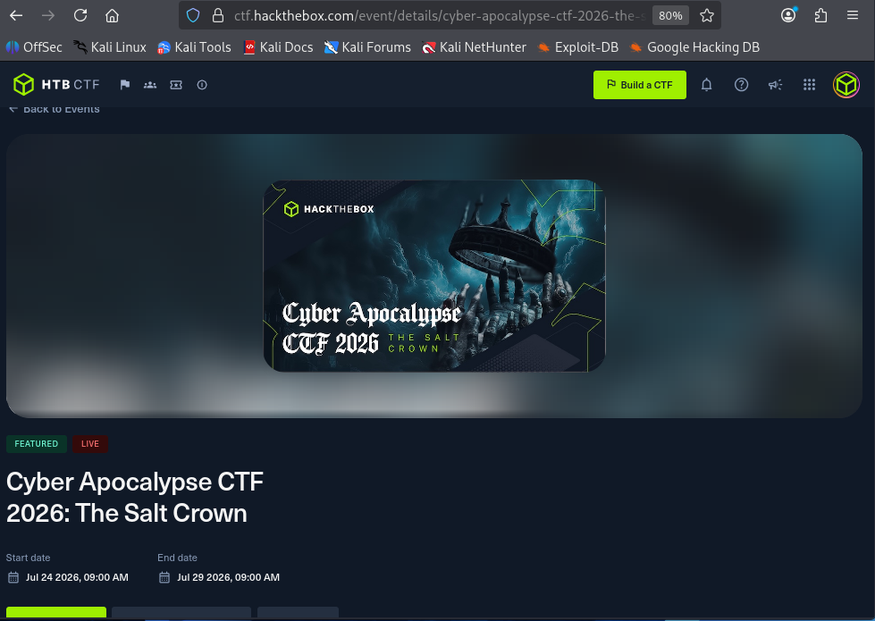

# Cyber Apocalypse CTF 2026: The Salt Crown

- **Event:** Cyber Apocalypse CTF 2026: The Salt Crown
- **Organizer:** Hack The Box
- **Format:** Jeopardy, HTB-style (flag format `HTB{...}`)
- **Start date:** 24/07/2026 09:00 AM
- **End date:** 29/07/2026 09:00 AM
- **Event page:** https://ctf.hackthebox.com/event/details/cyber-apocalypse-ctf-2026-the-salt-crown

## Writeups

| Challenge | Category | Difficulty | Tags | Date |
|---|---|---|---|---|
| [Force Push](./ForcePush/) | Forensics | Very Easy | git, forensics | 25/07/2026 |
| [Deception Strategy](./DeceptionStrategy/) | Forensics | Easy | DFIR, procmon, pcap, radare2, ghidra, RC4 | 25/07/2026 |
| [CorpSyncAudit](./CorpSyncAudit/) | Reverse Engineering | Hard | radare2, ghidra, wine, gdb | 26/07/2026 |
| [What the Shard Displayed](./WhatTheShardDisplayed/) | Hardware | Medium | i2c, sigrok, ssd1306, logic-analyzer | 28/07/2026 |
| [Wireless Connections](./WirelessConnections/) | Hardware | Hard | esp32-s3, xtensa, ghidra, firmware, esp-now | 29/07/2026 |
