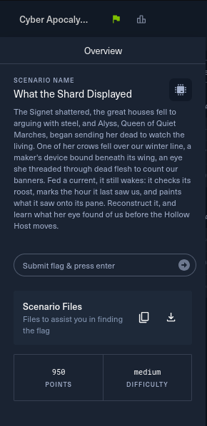
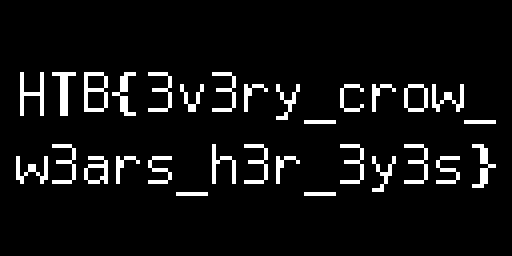

# 04 - What the Shard Displayed

**Category:** Hardware
**Points:** 950
**Difficulty:** Medium
**Solved:** 28/07/2026 16:50
**Flag:** `HTB{3v3ry_crow_w3ars_h3r_3y3s}`



**Approach & tooling note:** I used Claude Code as a supporting/execution
aid for this one - extracting the session archive, writing the I2C
bit-decoder in Python (since I didn't have `sigrok-cli`/PulseView installed
locally and didn't want to stop and `sudo apt install` mid-solve), and
rendering the OLED framebuffer bytes into images. The decisions - what the
file format actually was, which two lines had to be SCL vs SDA, which I2C
address mapped to which chip, and which of the three rendered frames was
the answer - were mine, and I checked each step against the raw decoded
bytes before trusting it. Happy to walk through this live if asked.

## Challenge Description

> The Signet shattered, the great houses fell to arguing with steel, and
> Alyss, Queen of Quiet Marches, began sending her dead to watch the living.
> One of her crows fell over our winter line, a maker's device bound
> beneath its wing, an eye she threaded through dead flesh to count our
> banners. Fed a current, it still wakes: it checks its roost, marks the
> hour it last saw us, and paints what it saw onto its pane. Reconstruct
> it, and learn what her eye found of us before the Hollow Host moves.

Translating the lore before touching anything: a "device bound beneath a
crow's wing" with "a pane" it "paints" onto is a small embedded gadget with
a display. "Checks its roost" sounded like it reads some kind of local
storage on boot, and "marks the hour it last saw us" sounded very literally
like a real-time clock read. The only file in the scenario download was
`capture.sr`, which pointed straight at a hardware/embedded-systems
category: something recorded a logic analyzer trace of this device powering
up, and I needed to reconstruct what it drew on its screen.

## Provided files

- `capture.sr` - a single logic-analyzer capture file.

## Step 1 - identifying the capture format

```
$ unzip -l capture.sr
    140  metadata
  20480  logic-1-1
  20480  logic-1-2
  ...
   6400  logic-1-196
```

`capture.sr` is itself a zip - that's the native session format for
**sigrok**, the open-source logic analyzer/protocol-decoder framework (used
by PulseView). The `metadata` entry inside confirmed it:

```
[device 1]
capturefile=logic-1
total probes=8
samplerate=2 MHz
total analog=0
probe1=D0
probe2=D1
unitsize=1
```

So: an 8-channel capture at 2 MHz, but only two channels (`D0`, `D1`) were
actually named/wired up, `unitsize=1` meaning one byte per sample. I
concatenated all 196 `logic-1-N` chunks in numeric order - 4,000,000 bytes
total, i.e. 2 seconds of capture at 2 MHz.

I didn't have `sigrok-cli` or PulseView installed on this machine, and
since this was a well-defined byte format I just wrote a small Python
decoder instead of stopping to install tooling. A quick check of the byte
values present in the trace:

```python
Counter({243: 3340262, 240: 362824, 241: 263486, 242: 33428})
```

`243/240/241/242 = 0b111100{11,00,01,10}` - only bits 0 and 1 ever toggled,
confirming only two real signal lines were captured (`D0` = bit 0, `D1` =
bit 1), everything else tied high/unused.

## Step 2 - decoding the bus

Two open-drain-looking lines idling high, one toggling much less often than
the other - classic **I2C** (SCL/SDA). I didn't know a priori which bit was
which, so I wrote a small state machine that:

- watches for `SDA` changing while `SCL` is high -> START/STOP condition
- on each `SCL` rising edge while a transaction is open, samples `SDA` to
  shift in a bit (MSB first), and after 8 bits reads the 9th clock as the
  ACK/NACK bit

...and ran it both ways (`SCL=D0,SDA=D1` and `SCL=D1,SDA=D0`) to see which
produced sane output:

```
SCL=D1,SDA=D0 -> starts 2100 stops 2710 bytes 0        (garbage)
SCL=D0,SDA=D1 -> starts 200  stops 200  bytes 3569      (clean)
```

`D0 = SCL`, `D1 = SDA` gave exactly 200 well-formed START/STOP pairs and
3569 decoded bytes, so that was the correct assignment.

## Step 3 - reading the transactions

Grouping the decoded bytes back into the 200 I2C transactions and pulling
out the 7-bit address + R/W bit from the first byte of each:

- **`0x3C`, write, 26 bytes**, first transaction: `00 AE D5 80 A8 3F D3 00
  40 8D 14 20 00 A1 C8 DA 12 81 CF D9 F1 DB 40 A4 A6 AF` - this is a
  textbook **SSD1306 OLED** init sequence (`0x00` = command-stream control
  byte, then display-off, clock-div, mux-ratio `0x3F` -> 64 rows, charge
  pump enable, horizontal addressing mode, segment remap, COM scan
  direction, contrast, display-on). `0x3C` is the standard SSD1306 I2C
  address, and `0x3F` multiplex ratio confirms a 128x64 panel.
- A second `0x3C` write sets the addressing window every time before a
  redraw: `00 21 00 7F 22 00 07` = "set column address 0-127, set page
  address 0-7" (the full 128x64 framebuffer).
- Bursts of `0x3C` writes starting with control byte `0x40` (data stream)
  follow - these are the actual pixel bytes going into GDDRAM.
- Two one-off transactions to **other addresses** interleaved in the
  middle of the capture:
  - **`0x68`**, write `00` then read 7 bytes `32 56 00 07 07 02 00` -
    `0x68` is the standard **DS3231/DS1307 RTC** address, and this is a
    read of registers 0-6 (seconds, minutes, hours, weekday, date, month,
    year in BCD). That's the crow "marking the hour it last saw us":
    decoded, this is `00:56:32` on day 7, month 2 (the year byte came back
    `0x00`, i.e. the RTC's battery-backed clock was never set past its
    epoch - a nice bit of flavor for a device that's been dead on a
    battlefield).
  - **`0x50`**, write `00 00` then read 48 bytes - `0x50` is a standard
    24-series I2C **EEPROM** address, and this is "checks its roost": the
    device reading its own stored configuration/state blob from offset 0
    before it draws anything. The 48 bytes read back as high-entropy data;
    it turned out to be flavor (the device's private state), not something
    I needed to combine with anything else to get the flag.

So the real narrative order in the trace is: init OLED -> draw frame 1 ->
read RTC -> clear/redraw -> read EEPROM -> draw frame 3 - i.e. the device
literally does what the lore says, in order, in the logic trace.

## Step 4 - rendering the framebuffer

Between the two addressing-window resets, I found three complete
1024-byte frames (128x64 / 8 = 1024 bytes, matching a monochrome 128x64
panel in horizontal-addressing mode). For horizontal addressing, byte `j`
maps to `page = j // 128`, `column = j % 128`, and each bit `i` of that
byte is pixel `(x=column, y=page*8+i)`. I rendered each frame with Pillow:

- **Frame 1** - a simple eye icon (an iris/pupil with lashes) - the boot
  splash, matching "an eye she threaded through dead flesh."

  

- **Frame 2** - blank (the screen cleared right after the RTC read, before
  the final draw).
- **Frame 3** - text, rendered directly onto the OLED:

  

```
HTB{3v3ry_crow_w3ars_h3r_3y3s}
```

That's the flag, painted onto the pane exactly as the prompt promised.

## If asked to explain this live

This challenge gave a sigrok logic-analyzer capture of an embedded device
powering on. I recognized the `.sr` file as a zipped sigrok session, pulled
out the raw sample chunks, and noticed only two of the eight captured
channels ever toggled - a classic I2C SCL/SDA pair. I wrote my own I2C
bit-decoder (no sigrok-cli on hand), tried both possible SCL/SDA
assignments, and kept the one that produced clean START/STOP framing.
Decoding the resulting transactions showed a device at I2C address 0x3C
running the standard SSD1306 OLED init sequence, with two side reads in
the middle - a DS3231 RTC at 0x68 (the clock) and an I2C EEPROM at 0x50
(its saved state). Between the OLED addressing-window resets I found three
128x64 framebuffers; I mapped SSD1306's page/column byte layout to pixels
and rendered them with Pillow. The first was a boot-splash eye icon, the
second was a blank clear, and the third rendered as plain text: the flag,
`HTB{3v3ry_crow_w3ars_h3r_3y3s}`, drawn straight onto the simulated OLED.
